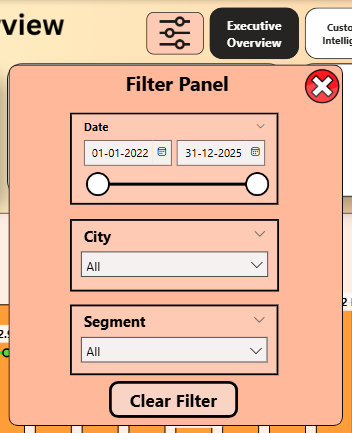

# 🍔 Swiggy Sales Analysis — Power BI Documentation

> **Project:** Swiggy Sales Analysis | **Tool:** Microsoft Power BI Desktop  
> **Period:** 2022 – 2025 | **Dashboards:** 7 | **Data Volume:** 6,00,000+ Orders & 17,00,000+ Order_Items

---

## 📋 Table of Contents

1. [Project Overview](#1-project-overview)
2. [Data Architecture](#2-data-architecture)
3. [Data Model & Relationships](#3-data-model--relationships)
4. [Date Table (Custom Calendar)](#4-date-table-custom-calendar)
5. [Global UX Features](#5-global-ux-features)
6. [Dashboard 1 — Executive Overview](#6-dashboard-1--executive-overview)
7. [Dashboard 2 — Customer Intelligence](#7-dashboard-2--customer-intelligence)
8. [Dashboard 3 — Revenue Analytics](#8-dashboard-3--revenue-analytics)
9. [Dashboard 4 — Restaurant Performance](#9-dashboard-4--restaurant-performance)
10. [Dashboard 5 — Menu & Product Intelligence](#10-dashboard-5--menu--product-intelligence)
11. [Dashboard 6 — Operations & Efficiency](#11-dashboard-6--operations--efficiency)
12. [Dashboard 7 — Market Expansion](#12-dashboard-7--market-expansion)
13. [Key Insights & Business Findings](#13-key-insights--business-findings)
14. [Strategic Recommendations](#14-strategic-recommendations)
15. [Author](#-author)

---

## 1. Project Overview

### 🎯 Executive Summary

Swiggy, one of India's leading food delivery platforms, operates across **10 major cities** with over **1,000 restaurant partners**. This Power BI project delivers a comprehensive, interactive analytics suite built on **600,000+ orders** spanning 4 years (2022–2025), generating **₹39.62 Crores** in gross order value.

The report is structured into **7 purpose-built dashboards**, each targeting a distinct business domain — from executive-level KPIs to granular operational and market insights.

### 📌 Business Objectives

| # | Objective | Dashboard |
|---|-----------|-----------|
| 1 | Monitor overall business health with YoY KPI tracking | Executive Overview |
| 2 | Segment customers using RFM model & CLV analysis | Customer Intelligence |
| 3 | Track revenue trends across time, city, and cuisine | Revenue Analytics |
| 4 | Evaluate restaurant partner efficiency and performance | Restaurant Performance |
| 5 | Identify top-selling items and basket behavior | Menu & Product Intelligence |
| 6 | Analyze order fulfillment, cancellations, and peak demand | Operations & Efficiency |
| 7 | Identify high-potential cities for strategic expansion | Market Expansion |

### 🗂️ Source Tables

| Table | Description |
|-------|-------------|
| `orders_master` | Core fact table — all orders with status, city, cuisine, time, amount |
| `order_items_master` | Line-item table — individual items per order with price and category |
| `DateTable` | Custom-built calendar table with fiscal year, quarter, weekday flags |
| `Customer Segments` | Calculated table derived from RFM scoring |
| `City Demographics` | Static DATATABLE with population, income, and urbanization rate |

---

## 2. Data Architecture

### 🏗️ Schema Design

The Power BI data model follows a **Star Schema** pattern:

```
                    ┌─────────────────┐
                    │   DateTable     │  ← Custom Calendar (2022–2025)
                    │  (Dimension)    │
                    └────────┬────────┘
                             │
                             │                  
┌───────────────────┐        │       ┌────────────────────┐
│  orders_master    │◄───────┘       │ order_items_master │
│   (Fact Table)    │───────────────►│   (Fact Table)     │                                     
└─────────┬─────────┘                └────────────────────┘
          │
          ├◄──── Customer Segments  (Calculated Table)
          │
          └◄──── City Demographics  (Static DATATABLE)
```

### 📂 Calculated / Static Tables

| Table | Type | Purpose |
|-------|------|---------|
| `Customer Segments` | Calculated (`ADDCOLUMNS` + `SUMMARIZE`) | Stores RFM Segment, CLV, Recency, Frequency, Monetary per customer |
| `City Demographics` | Static (`DATATABLE`) | Population, urbanization rate, and avg. income for 10 cities |

---

## 3. Data Model & Relationships

| From Table | From Column | To Table | To Column | Cardinality |
|---|---|---|---|---|
| `orders_master` | `order_date` | `DateTable` | `Date` | Many-to-One |
| `order_items_master` | `order_id` | `orders_master` | `order_id` | Many-to-One |
| `orders_master` | `city` | `City Demographics` | `city` | Many-to-One |
| `Customer Segments` | `user_id` | `orders_master` | `user_id` | One-to-Many |

---

## 4. Date Table (Custom Calendar)

A fully custom `DateTable` was built using `CALENDAR()` + `ADDCOLUMNS()` to support time intelligence across all dashboards.

### DAX Code

```dax
DateTable = 
ADDCOLUMNS(
    CALENDAR(DATE(2022,1,1), DATE(2025,12,31)),
    "Year",          YEAR([Date]),
    "Quarter",       "Q" & FORMAT([Date], "Q"),
    "QuarterNum",    QUARTER([Date]),
    "Month",         FORMAT([Date], "MMMM"),
    "MonthNum",      MONTH([Date]),
    "MonthShort",    FORMAT([Date], "MMM"),
    "YearMonth",     FORMAT([Date], "YYYY-MM"),
    "YearQuarter",   FORMAT([Date], "YYYY") & " Q" & FORMAT([Date], "Q"),
    "WeekDay",       FORMAT([Date], "dddd"),
    "DayOfWeek",     WEEKDAY([Date]),
    "DayOfMonth",    DAY([Date]),
    "IsWeekend",     IF(WEEKDAY([Date]) IN {1,7}, "Weekend", "Weekday"),
    "FiscalYear",    IF(MONTH([Date]) >= 4, YEAR([Date]), YEAR([Date]) - 1),
    "FiscalQuarter", 
        IF(MONTH([Date]) >= 4, 
           "Q" & FORMAT(QUARTER(DATE(YEAR([Date]), MONTH([Date]) - 3, 1)), "0"),
           "Q" & FORMAT(QUARTER(DATE(YEAR([Date]) - 1, MONTH([Date]) + 9, 1)), "0")
        )
)
```

### Columns Generated

| Column | Description |
|--------|-------------|
| `Year` | Calendar year (2022–2025) |
| `Quarter` / `QuarterNum` | Q1–Q4 label and numeric value |
| `Month` / `MonthNum` / `MonthShort` | Full name, number, and abbreviation |
| `YearMonth` | YYYY-MM format for trend charts |
| `YearQuarter` | YYYY Q# format for quarterly views |
| `WeekDay` / `DayOfWeek` | Day name and weekday number |
| `IsWeekend` | "Weekend" or "Weekday" flag |
| `FiscalYear` | India fiscal year (April–March start) |
| `FiscalQuarter` | Fiscal quarter label |

---

## 5. Global UX Features

### 🧭 Navigation Bar

All 7 dashboards share a **consistent top navigation bar** containing button-style links to each dashboard. The currently active dashboard is visually highlighted (dark/filled button), while others remain unselected — enabling single-click navigation across the entire report.

| Button Label | Navigates To |
|---|---|
| Executive Overview | Dashboard 1 |
| Customer Intelligence | Dashboard 2 |
| Revenue Analytics | Dashboard 3 |
| Restaurant Performance | Dashboard 4 |
| Menu & Product Intelligence | Dashboard 5 |
| Operations & Efficiency | Dashboard 6 |
| Market Expansion | Dashboard 7 |

### 🔍 Filter Panel Toggle (Filter Icon Button)

Each dashboard features a **filter icon button** (⚙️ icon, top-left near title) that toggles the visibility of the filter/slicer panel. This keeps the dashboard canvas clean by default while allowing users to expand filters on demand.

**How it works:**
- The filter icon is an Image button bound to a **Bookmark**.
- Two bookmarks are created per dashboard: one with the filter panel visible, one hidden.
- Clicking the icon switches between bookmarks, showing or hiding the slicer panel.

### 📸 Filter Panel Preview


### 🎨 Design System

| Element | Value |
|---------|-------|
| Primary Color | Orange `#FF6B00` (Swiggy brand) |
| Background | Warm cream / light peach |
| KPI Positive Color | Green |
| KPI Negative Color | Red |
| Accent (highlights) | Yellow / Gold |
| Font | Segoe UI / DIN |
| Logo | Swiggy logo (top-left on every dashboard) |

---

## 6. Dashboard 1 — 🔥Executive Overview

### 📸 Dashboard Preview


### 🎯 Purpose

Provides a **bird's-eye view** of Swiggy's overall business health. Designed for C-suite and senior leadership to monitor top-level KPIs, revenue trends, and critical operational alerts at a glance.

### 📊 Visuals

| Visual | Type | Fields Used |
|--------|------|-------------|
| Total Revenue KPI Card | Card | `Total Revenue Display`, `Revenue Growth Display` |
| Total Orders KPI Card | Card | `Total Orders`, `Orders Growth Display` |
| Total Customer KPI Card | Card | `Total Customers`, `Customers Growth Display` |
| AOV KPI Card | Card | `AOV`, `AOV Growth Display` |
| Revenue & Orders Trend | Combo Chart (Bar + Line) | `YearMonth` (X-axis), `Delivered Orders` (Bar), `Total Revenue` (Line) |
| Critical Alerts & Insights | Text Cards | `Alert - Cancellation`, `Alert - High Cancel City`, `Alert - At Risk Customers`, `Alert - Growth Status` |
| Top Revenue City | Card | `Top City Display` |
| Top Cuisine | Card | `Top Cuisine Display` |
| Peak Ordering Time | Card | `Peak Time Display` |
| Top Restaurant | Card | `Top Restaurant Display` |

### 📈 Key Metrics Displayed

| KPI | Value | vs LY |
|-----|-------|-------|
| Total Revenue | ₹39.62 Cr | ▼ -0.58% |
| Total Orders | 6,00,000 | ▼ -0.56% |
| Total Customers | 10,000 | ▼ -0.10% |
| AOV | ₹694.67 | ▼ -0.01% |
| Top Revenue City | Mumbai | ₹8.76 Cr |
| Top Cuisine | Seafood | ₹2.37 Cr |
| Peak Ordering Time | Lunch | 2,54,949 orders |
| Top Restaurant | Spice | ₹40.32 L |

### ⚠️ Critical Alerts Shown

- 🔴 **Cancellation Rate: 4.95% (WARNING)** — Approaching critical 5% threshold
- 🔴 **Delhi: 5.09% Cancellation** — Highest cancellation city
- 👥 **3,722 Customers at Risk (₹2.74 Cr Loss)** — Potential revenue loss from churn
- 📉 **Declining: -0.58% YoY** — Revenue contraction signal

### 🔢 DAX Measures

#### Revenue Measures

```dax
Total Revenue = 
CALCULATE(
    SUM(orders_master[total_amount]),
    KEEPFILTERS(orders_master[order_status] = "Delivered")
)

Total Revenue Display = 
"₹" & FORMAT([Total Revenue] / 10000000, "0.00") & " Cr"

Revenue CY = 
VAR EndDate = MAX('DateTable'[Date])
VAR StartDate = EDATE(EndDate, -12) + 1
RETURN
CALCULATE(
    [Total Revenue],
    REMOVEFILTERS('DateTable'),
    'DateTable'[Date] >= StartDate,
    'DateTable'[Date] <= EndDate
)

Revenue LY = 
VAR CurrentEndDate = MAX('DateTable'[Date])
VAR PriorEndDate = EDATE(CurrentEndDate, -12)
VAR PriorStartDate = EDATE(PriorEndDate, -12) + 1
RETURN
CALCULATE(
    [Total Revenue],
    REMOVEFILTERS('DateTable'),
    'DateTable'[Date] >= PriorStartDate,
    'DateTable'[Date] <= PriorEndDate
)

Revenue Growth % = 
DIVIDE([Revenue CY] - [Revenue LY], [Revenue LY], 0)

Revenue Growth Display = 
VAR _growth = [Revenue Growth %]
VAR _arrow = IF(_growth > 0, "▲", "▼")
RETURN
IF(
    ISBLANK([Revenue LY]) || [Revenue LY] = 0,
    "No Prior Data",
    _arrow & " " & FORMAT(_growth, "0.00%") & " vs LY"
)
```

#### Order Measures

```dax
Total Orders    = COUNTROWS(orders_master)
Delivered Orders = CALCULATE(COUNTROWS(orders_master), orders_master[order_status] = "Delivered")
Cancelled Orders = CALCULATE(COUNTROWS(orders_master), orders_master[order_status] = "Cancelled")

Orders CY = -- (rolling 12-month count of delivered orders)
Orders LY = -- (prior 12-month count of delivered orders)
Orders Growth % = DIVIDE([Orders CY] - [Orders LY], [Orders LY], 0)
```

#### Customer Measures

```dax
Total Customers = DISTINCTCOUNT(orders_master[user_id])
Customers CY    = -- (rolling 12-month distinct customers)
Customers LY    = -- (prior 12-month distinct customers)
Customers Growth % = DIVIDE([Customers CY] - [Customers LY], [Customers LY], 0)
```

#### AOV Measures

```dax
AOV           = DIVIDE([Total Revenue], [Delivered Orders], 0)
AOV CY        = DIVIDE([Revenue CY], [Orders CY], 0)
AOV LY        = DIVIDE([Revenue LY], [Orders LY], 0)
AOV Growth %  = DIVIDE([AOV CY] - [AOV LY], [AOV LY], 0)
```

#### Other Core Measures

```dax
Fulfillment Rate %  = DIVIDE([Delivered Orders], [Total Orders], 0)
Cancellation Rate % = DIVIDE([Cancelled Orders], [Total Orders], 0)
```

#### Top Performer Measures

```dax
Top City Name = 
VAR _TopCity = TOPN(1, VALUES(orders_master[city]), [Total Revenue], DESC)
RETURN MAXX(_TopCity, orders_master[city])

Top City Display    = [Top City Name] & UNICHAR(10) & "₹" & FORMAT([Top City Revenue] / 10000000, "0.00") & " Cr"
Top Cuisine Display = [Top Cuisine Name] & UNICHAR(10) & "₹" & FORMAT([Top Cuisine Revenue] / 10000000, "0.00") & " Cr"
Peak Time Display   = [Peak Time] & UNICHAR(10) & FORMAT([Peak Time Orders], "#,##0") & " orders"
Top Restaurant Display = [Top Restaurant Name] & UNICHAR(10) & "₹" & FORMAT([Top Restaurant Revenue] / 100000, "0.00") & " L"
```

#### Alert Measures

```dax
Alert - Cancellation = 
VAR CancRate = [Cancellation Rate %]
VAR Icon = IF(CancRate >= 0.0499, "🔴", IF(CancRate >= 0.03, "🚫", "✅"))
RETURN Icon & " Cancellation Rate: " & FORMAT(CancRate, "0.00%") & 
    IF(CancRate >= 0.0499, " (CRITICAL)", IF(CancRate >= 0.03, " (WARNING)", ""))

Alert - At Risk Customers = -- Finds customers with last order > 90 days ago
Alert - Growth Status     = -- Shows ▲/▼ trend with growth classification
```

### 🔽 Slicers / Filters

| # | Slicer | Field |
|---|--------|-------|
| 1 | Date Range | `DateTable[Date]` |
| 2 | City | `orders_master[city]` |
| 3 | Customer Segment | `orders_master[segment]` |

---

## 7. Dashboard 2 — 👥Customer Intelligence

### 📸 Dashboard Preview


### 🎯 Purpose

Delivers deep customer analytics using the **RFM (Recency, Frequency, Monetary) model** and **Customer Lifetime Value (CLV)** calculations. Identifies customer segments, engagement behavior, and cohort-based retention patterns.

### 📊 Visuals

| Visual | Type | Fields Used |
|--------|------|-------------|
| Total CLV KPI | Card | `Total CLV Display` |
| Champions Count KPI | Card | `Champions Display`, `Champions % Display` |
| At Risk Customers KPI | Card | `At Risk Display`, `At Risk Cr Display` |
| Engagement Rate KPI | Card | `Avg Orders per Customer Display` |
| Customer Segmentation (RFM) | Donut Chart | `RFM Segment`, `Total Customers` |
| RFM Behavior Matrix | Scatter Chart | Avg. Purchase Frequency (X), Avg. Monetary Value (Y), `RFM Segment` (Legend) |
| Cohort Retention Analysis | Matrix (Heatmap) | `FirstOrderMonth` (Rows), `MonthsFromFirst` (Columns), `Cohort Retention %` (Values) |
| Champions CLV Card | Text Card | `Champions CLV Card` |
| Loyal Customers CLV Card | Text Card | `Loyal CLV Card` |
| Promising CLV Card | Text Card | `Promising CLV Card` |
| At Risk CLV Card | Text Card | `At Risk CLV Card` |

### 📈 Key Metrics Displayed

| KPI | Value |
|-----|-------|
| Total Customer Lifetime Value | ₹33.67 Cr |
| Champions (Best Customers) | 2,475 (24.75% of customers) |
| At Risk Customers | 1,972 (₹1.55 Cr at Stake) |
| Engagement Rate | 60 Orders per Customer |

### 👥 RFM Segment Breakdown

| Segment | Count | Share | Avg CLV | Total Value |
|---------|-------|-------|---------|-------------|
| Champions | 2,475 | 24.75% | ₹115.99K | ₹28.71 Cr |
| Loyal Customers | 1,629 | 16.29% | ₹9.04K | ₹1.47 Cr |
| At Risk | 1,972 | 19.72% | ₹7.85K | ₹1.55 Cr at stake |
| Promising | 1,268 | 12.68% | ₹5.08K | ₹0.64 Cr |
| Lost | 1,058 | 10.58% | — | — |
| New Customers | 720 | 7.20% | — | — |
| Potential Loyalists | 650 | 6.50% | — | — |

### 🔢 DAX Measures

#### RFM Scoring

```dax
Recency Days = 
VAR CustomerLastOrderDate = MAX(orders_master[order_date])
VAR TodayDate = TODAY()
RETURN DATEDIFF(CustomerLastOrderDate, TodayDate, DAY)

Frequency    = [Delivered Orders]
Monetary Value = [Total Revenue]

R Score = 
-- Assigns 1–5 based on recency percentile (lower days = higher score)
SWITCH(TRUE(),
    [Recency Days] <= Q1, 5,
    [Recency Days] <= Q2, 4,
    [Recency Days] <= Q3, 3,
    [Recency Days] <= Q4, 2,
    1
)

F Score = -- Assigns 1–5 based on frequency percentile (higher = better)
M Score = -- Assigns 1–5 based on monetary percentile (higher = better)

RFM Segment = 
VAR R = [R Score]
VAR F = [F Score]
VAR M = [M Score]
RETURN
SWITCH(TRUE(),
    R >= 4 && F >= 4 && M >= 4, "Champions",
    R >= 3 && F >= 3 && M >= 3, "Loyal Customers",
    R >= 4 && F < 3,            "Potential Loyalists",
    R >= 3 && F < 3,            "New Customers",
    R < 3  && F >= 3,           "At Risk",
    R < 2  && F >= 3,           "Can't Lose Them",
    R < 3  && F < 3 && M >= 3,  "Hibernating",
    R < 2,                      "Lost",
    "Promising"
)
```

#### CLV (Customer Lifetime Value)

```dax
Customer AOV = DIVIDE([Monetary Value], [Frequency], 0)

Customer Lifetime Value = 
VAR AOV             = [Customer AOV]
VAR OrdersPerMonth  = DIVIDE([Frequency], 12, 0)
VAR LifespanMonths  = 36
VAR RetentionRate   = 0.85
VAR GrossMargin     = 0.25
RETURN AOV * OrdersPerMonth * LifespanMonths * RetentionRate * GrossMargin

Average CLV    = AVERAGEX(VALUES(orders_master[user_id]), [Customer Lifetime Value])
Total CLV      = SUMX(VALUES(orders_master[user_id]), [Customer Lifetime Value])
```

#### Cohort Analysis (Power Query Columns)

```m
-- Column 1: CohortMonth
Date.StartOfMonth([order_date])

-- Column 2: FirstOrderMonth
let 
    currentID = [user_id],
    MinDate = List.Min(
        Table.SelectRows(#"Previous Step Name", each [user_id] = currentID)[order_date]
    )
in Date.StartOfMonth(MinDate)

-- Column 3: MonthsFromFirst
(Date.Year([CohortMonth]) - Date.Year([FirstOrderMonth])) * 12 + 
(Date.Month([CohortMonth]) - Date.Month([FirstOrderMonth]))
```

```dax
Cohort Retention % = 
VAR SelectedCohort = SELECTEDVALUE(orders_master[FirstOrderMonth])
VAR SelectedMonth  = SELECTEDVALUE(orders_master[MonthsFromFirst])
VAR CohortSize     = CALCULATE(DISTINCTCOUNT(orders_master[user_id]),
                        orders_master[FirstOrderMonth] = SelectedCohort,
                        orders_master[MonthsFromFirst] = 0)
VAR ActiveInMonth  = CALCULATE(DISTINCTCOUNT(orders_master[user_id]),
                        orders_master[FirstOrderMonth] = SelectedCohort,
                        orders_master[MonthsFromFirst] = SelectedMonth)
RETURN DIVIDE(ActiveInMonth, CohortSize, 0)
```

#### Customer Segments Calculated Table

```dax
Customer Segments = 
ADDCOLUMNS(
    SUMMARIZE(orders_master, orders_master[user_id]),
    "Segment",   [RFM Segment],
    "CLV",       [Customer Lifetime Value],
    "Recency",   [Recency Days],
    "Frequency", [Frequency],
    "Monetary",  [Monetary Value]
)
```

### 🔽 Slicers / Filters

| # | Slicer | Field |
|---|--------|-------|
| 1 | Date Range | `DateTable[Date]` |
| 2 | City | `orders_master[city]` |
| 3 | Customer Segment | `Customer Segments[Segment]` |

---

## 8. Dashboard 3 — 💰Revenue Analytics

### 📸 Dashboard Preview


### 🎯 Purpose

Provides multi-dimensional revenue analysis across time (MTD/QTD/YTD), city, cuisine, time slot, and weekday vs. weekend patterns. Supports pricing strategy and seasonal planning decisions.

### 📊 Visuals

| Visual | Type | Fields Used |
|--------|------|-------------|
| MTD Revenue KPI | Card | `MTD Display`, `MTD Growth Display` |
| QTD Revenue KPI | Card | `QTD Display`, `QTD Growth Display` |
| YTD Revenue KPI | Card | `YTD Display`, `YTD Growth Display` |
| YoY Performance KPI | Card | `YOY_Display`, `Target Achievement Display` |
| Revenue & Orders Trend | Combo Chart | `YearMonth`, `Total Orders`, `Total Revenue`, Revenue Target |
| Top 10 Cities by Revenue | Bar Chart | `orders_master[city]`, `Total Revenue Cr`, `Target City Revenue` |
| Weekend vs Weekday Revenue | Donut Chart | `IsWeekend`, `Total Revenue` |
| Revenue Contribution by Cuisine | Matrix | `cuisine` (Rows), `Total Revenue` (Values) |
| Avg Order Value by Time Slot | Combo Chart | `time_slot`, `AOV` (Bars), Order Volume (Line) |
| Revenue Performance Matrix | Table | Year, Quarter, Revenue, YTD Growth, Target Achievement |

### 📈 Key Metrics Displayed

| KPI | Value | vs Period |
|-----|-------|-----------|
| Month-to-Date Revenue | ₹0.85 Cr | ▲ +4.39% vs LM |
| Quarter-to-Date Revenue | ₹2.53 Cr | ▲ +1.52% vs LQ |
| Year-to-Date Revenue | ₹9.91 Cr | ▼ -0.58% vs LY |
| YoY Growth | -0.58% | ▼ -9.61% of Target |
| Top City | Mumbai | ₹8.76 Cr |
| Weekend Revenue Share | ₹11.34 Cr | 28.63% |
| Weekday Revenue Share | ₹28.27 Cr | 71.37% |

### 🔢 DAX Measures

#### Time Intelligence Measures

```dax
MTD Revenue = TOTALMTD([Total Revenue], DateTable[Date])
QTD Revenue = TOTALQTD([Total Revenue], DateTable[Date])
YTD Revenue = TOTALYTD([Total Revenue], DateTable[Date])

MTD Revenue LM = CALCULATE([MTD Revenue], DATEADD(DateTable[Date], -1, MONTH))
QTD Revenue LQ = CALCULATE([QTD Revenue], DATEADD('DateTable'[Date], -1, QUARTER))
YTD Revenue LY = CALCULATE([YTD Revenue], DATEADD('DateTable'[Date], -1, YEAR))

MTD Growth %  = DIVIDE([MTD Revenue] - [MTD Revenue LM], [MTD Revenue LM], 0)
QTD Growth %  = DIVIDE([QTD Revenue] - [QTD Revenue LQ], [QTD Revenue LQ], 0)
YTD Growth %  = DIVIDE([YTD Revenue] - [YTD Revenue LY], [YTD Revenue LY], 0)
```

#### Target & Achievement

```dax
Revenue Target Year      = [Revenue LY] * 1.10
Target Achievement       = [Revenue CY] - [Revenue Target Year]
Target Achievement %     = DIVIDE([Target Achievement], [Revenue Target Year], 0)

Revenue Target Month     = [Revenue LM] * 1.10
```

#### City & Cuisine

```dax
City Revenue Rank = RANKX(ALL(orders_master[city]), [Total Revenue], , DESC, DENSE)
City Rank Display = "#" & FORMAT([City Revenue Rank], "0")

Max City Revenue  = MAXX(ALL('orders_master'[city]), [Total Revenue])
Target City Revenue = [Max City Revenue] * (3/5)

Total Revenue Cr      = [Total Revenue] / 10000000
Cuisine Revenue %     = DIVIDE([Total Revenue], CALCULATE([Total Revenue], ALL(orders_master[cuisine])), 0)
```

### 🔽 Slicers / Filters

| # | Slicer | Field |
|---|--------|-------|
| 1 | Date Range | `DateTable[Date]` |
| 2 | City | `orders_master[city]` |
| 3 | Cuisine | `orders_master[cuisine]` |

---

## 9. Dashboard 4 — 🏪Restaurant Performance

### 📸 Dashboard Preview


### 🎯 Purpose

Evaluates restaurant partners using a composite **Efficiency Score** (combining revenue, orders, and rating). Identifies Star Performers, underperforming restaurants, compares cloud kitchens vs. traditional restaurants, and maps cuisine performance by city.

### 📊 Visuals

| Visual | Type | Fields Used |
|--------|------|-------------|
| Total Partner Restaurants KPI | Card | `Total Restaurants` |
| Avg Revenue per Restaurant KPI | Card | `Avg Revenue per Restaurant Display` |
| Top Performing Restaurant KPI | Card | `Top Restaurant Revenue Display` |
| Underperforming Restaurants KPI | Card | `Underperforming Restaurants Display` |
| Top 20 Restaurants by Revenue | Bar Chart | `restaurant_name`, `Total Revenue`, Platform Avg reference line |
| Cloud Kitchen vs Traditional | Grouped Bar | `restaurant_type`, `Avg Revenue`, `Orders` |
| Rating Impact on Revenue | Scatter Chart | `Avg. Restaurant Rating` (X), `Total Revenue` (Y), `restaurant_type` (Color) |
| Cuisine Performance by City | Matrix | `city` (Rows), `cuisine` (Columns), `Total Revenue` (Values) |
| Restaurant Performance Scorecard | Table | Restaurant, City, Cuisine, Orders, Revenue, AOV, Rating, Efficiency Score, Category |

### 📈 Key Metrics Displayed

| KPI | Value |
|-----|-------|
| Total Partner Restaurants | 1,000 |
| Avg Revenue per Restaurant | ₹3.96 L |
| Top Performing Restaurant | Spice — ₹40.32 L |
| Underperforming Restaurants | 146 (14.60% of total) |

### 🏆 Top Restaurants

| Rank | Restaurant | Revenue |
|------|------------|---------|
| 1 | Spice | ₹40.32 L |
| 2 | Spicy Paradise | ₹37.48 L |
| 3 | Delight | ₹34.52 L |
| 4 | Tasty Zone | ₹33.28 L |

### 🔢 DAX Measures

```dax
Total Restaurants = DISTINCTCOUNT(orders_master[restaurant_id])

Avg Revenue per Restaurant = DIVIDE([Total Revenue], [Total Restaurants], 0)

Restaurant Efficiency Score = 
VAR RevenueScore = DIVIDE([Total Revenue], AvgRevenue, 0)
VAR OrdersScore  = DIVIDE([Delivered Orders], AvgOrders, 0)
VAR RatingScore  = DIVIDE([Average Rating], AvgRating, 0)
RETURN
    (RevenueScore * 0.5) + (OrdersScore * 0.3) + (RatingScore * 0.2)

Performance Category = 
SWITCH(TRUE(),
    [Restaurant Efficiency Score] >= 1.5,  "⭐ Star Performer",
    [Restaurant Efficiency Score] >= 0.995, "✓ Good",
    [Restaurant Efficiency Score] >= 0.794, "⚠️ Average",
    "🔴 Needs Attention"
)

Underperforming Restaurants = 
CALCULATE([Total Restaurants],
    FILTER(VALUES(orders_master[restaurant_name]),
        [Restaurant Efficiency Score] <= 0.7))

Restaurant Revenue Rank = RANKX(ALL(orders_master[restaurant_name]), [Total Revenue], , DESC, DENSE)

Average Rating = AVERAGE(orders_master[restaurant_rating])
```

### 🔽 Slicers / Filters

| # | Slicer | Field |
|---|--------|-------|
| 1 | Date Range | `DateTable[Date]` |
| 2 | City | `orders_master[city]` |
| 3 | Cuisine | `orders_master[cuisine]` |

---

## 10. Dashboard 5 — 🍽️Menu & Product Intelligence

### 📸 Dashboard Preview


### 🎯 Purpose

Analyzes menu item performance, vegetarian vs. non-vegetarian split, price category revenue distribution, and basket composition behavior. Supports menu optimization and cross-sell/upsell strategy.

### 📊 Visuals

| Visual | Type | Fields Used |
|--------|------|-------------|
| Total Menu Items KPI | Card | `Total Menu Items` |
| Total Categories KPI | Card | `Total Categories` |
| Veg Percentage Display KPI | Card | `Veg Percentage Display` |
| Multi-Item Display KPI | Card | `Multi Item Display` |
| Top 20 Best-Selling Items | Combo Chart | `item_name`, `Times Ordered` (Bar), `Item Revenue` (Line) |
| Veg vs Non-Veg Revenue Split | Donut Chart | `item_type`, `Item Revenue` |
| Revenue by Price Category | Combo Chart | Price Category (X), `Total Revenue` (Bar), Orders (Line) |
| Items Performance Table | Table | Item, Orders, Revenue, Avg Price, Revenue Share |
| Revenue by Category | Treemap / Matrix | `category`, `Item Revenue` |
| Basket Analysis Insights | Text Cards | `Basket Insight 1–6` |

### 📈 Key Metrics Displayed

| KPI | Value |
|-----|-------|
| Total Menu Items | 57 |
| Total Categories | 7 |
| Veg Items | 82.46% (47 veg / 2,796 non-veg items) |
| Multi-Item Orders | 85.03% (2.78 items/order avg) |

### 🥇 Top Selling Items

| Rank | Item | Orders | Revenue | Avg Price |
|------|------|--------|---------|-----------|
| 1 | Paneer Burger | 45,164 | ₹1.45 Cr | ₹237.62 |
| 2 | Cheese Burger | 44,195 | ₹1.44 Cr | ₹241.26 |
| 3 | Aloo Tikki Burger | 43,925 | ₹1.42 Cr | ₹240.71 |
| 4 | Veg Burger | 44,002 | ₹1.42 Cr | ₹238.56 |
| 5 | Chicken Pizza | 38,946 | ₹1.32 Cr | ₹251.29 |

### 🛒 Basket Analysis

| Metric | Value |
|--------|-------|
| Average Items per Order | 2.78 |
| Multi-Item Order Rate | 85.03% |
| Single-Item Orders | 14.97% |
| Two-Item Orders | 30.10% |
| 3+ Item Orders | 54.93% |
| Average Basket Value | ₹695 |
| Top Combo | Cheese Burger + Paneer Burger (2,910 orders) |

### 🔢 DAX Measures

```dax
Total Menu Items   = DISTINCTCOUNT(order_items_master[item_name])
Total Categories   = DISTINCTCOUNT(order_items_master[category])

Veg Item Count     = CALCULATE(DISTINCTCOUNT(order_items_master[item_name]), order_items_master[item_type] = "Veg")
Veg Percentage     = DIVIDE([Veg Item Count], [Total Menu Items], 0)

Times Ordered      = COUNTROWS(order_items_master)
Item Revenue       = SUM(order_items_master[line_total])
Item Average Price = AVERAGE(order_items_master[menu_price])

Item Revenue Share % = 
DIVIDE([Item Revenue], CALCULATE([Item Revenue], ALL(order_items_master[item_name])), 0)

Item Rank by Revenue = RANKX(ALL(order_items_master[item_name]), [Item Revenue], , DESC, DENSE)

ABC Classification = 
VAR ItemRank  = [Item Rank by Revenue]
VAR TotalItems = CALCULATE([Total Menu Items], ALLSELECTED('order_items_master'))
RETURN
SWITCH(TRUE(),
    ItemRank <= TotalItems * 0.2, "A - High Value (Top 20%)",
    ItemRank <= TotalItems * 0.5, "B - Medium Value (20-50%)",
    "C - Low Value (Bottom 50%)"
)

Multi Item Orders  = CALCULATE(DISTINCTCOUNT(order_items_master[order_id]),
                        FILTER(VALUES(order_items_master[order_id]),
                            CALCULATE(COUNTROWS(order_items_master)) > 1))

Multi Item Order % = DIVIDE([Multi Item Orders], DISTINCTCOUNT(order_items_master[order_id]), 0)

Average Basket Value = DIVIDE(SUM(order_items_master[line_total]),
                           DISTINCTCOUNT(order_items_master[order_id]), 0)

Top Combo Name = -- GENERATE-based pair frequency analysis returning top item pair name
Top Combo Count = -- Returns count of the most frequently ordered item pair
```

### 🔽 Slicers / Filters

| # | Slicer | Field |
|---|--------|-------|
| 1 | Date Range | `DateTable[Date]` |
| 2 | Category | `order_items_master[category]` |
| 3 | Price Category | `order_items_master[price_category]` |

---

## 11. Dashboard 6 — ⚡Operations & Efficiency

### 📸 Dashboard Preview


### 🎯 Purpose

Monitors operational health — cancellation rates, fulfillment performance, peak demand patterns, payment method distribution, and city-level operational metrics. Powers fleet allocation and process improvement decisions.

### 📊 Visuals

| Visual | Type | Fields Used |
|--------|------|-------------|
| Cancellation Rate KPI | Card | `Cancellation Display` |
| Fulfillment Rate KPI | Card | `Fulfillment Display` |
| Peak Hour KPI | Card | `Peak Hour Display` |
| Orders Overview KPI | Card | `Orders Overview` |
| Cancellation Rate Trend | Line Chart | `YearMonth`, `Cancellation Rate %`, Avg reference line |
| Payment Method Analysis | Donut Chart | `payment_method`, `Total Orders` |
| Peak Hours Heatmap | Matrix | `Order Hour` (Rows), `Day Name` (Columns), `Total Orders` (Values) |
| City Performance Table | Table | City, Orders, Revenue, Cancel %, Fulfillment % |
| Time Slot Performance Table | Table | Time Slot, Orders, Revenue, Cancel %, Fulfill %, Avg Order |
| Operation & Efficiency Insights | Text Cards | `Insight 1–4` |

### 📈 Key Metrics Displayed

| KPI | Value |
|-----|-------|
| Cancellation Rate | 4.95% (29,719 orders, ₹2.08 Cr lost) |
| Fulfillment Rate | 95.05% (570,281 orders) — Target: 98% |
| Peak Hour | 1:00 PM (89,463 orders, 15% of daily volume) |
| Total Orders | 600,000 (570,281 delivered) |

### ⏰ Time Slot Performance

| Time Slot | Orders | Revenue | Cancel % | Fulfill % | Avg Order |
|-----------|--------|---------|----------|-----------|-----------|
| Lunch | 2,54,949 | ₹17.71 Cr | 4.95% | 95.05% | ₹660.33 |
| Dinner | 2,43,947 | ₹16.95 Cr | 4.94% | 95.06% | ₹660.58 |
| Breakfast | 35,723 | ₹2.48 Cr | 4.98% | 95.02% | ₹658.47 |
| Snack | 26,587 | ₹1.84 Cr | 4.91% | 95.09% | ₹658.58 |
| Late Night | 9,075 | ₹0.63 Cr | 5.18% | 94.82% | ₹662.03 |

### 💳 Payment Method Distribution

| Method | Orders | Share |
|--------|--------|-------|
| UPI | 229K | 40.09% |
| Credit Card | 142K | 24.98% |
| Debit Card | 85K | 14.xx% |
| Wallet | 57K | 9.98% |
| Cash on Delivery | 57K | 9.98% |

### 🔢 DAX Measures

```dax
Cancellation Loss Amount = 
CALCULATE(SUM(orders_master[total_amount]), orders_master[order_status] = "Cancelled")

Cancellation Display = 
FORMAT([Cancellation Rate %], "0.00%") & UNICHAR(10) &
FORMAT([Cancelled Orders], "#,##0") & " orders" & UNICHAR(10) &
"₹" & FORMAT([Cancellation Loss Amount] / 10000000, "0.0") & " Cr lost"

Fulfillment Display = 
FORMAT([Fulfillment Rate %], "0.00%") & UNICHAR(10) &
FORMAT([Delivered Orders], "#,##0") & " orders" & UNICHAR(10) & "Target: 98%"

Peak Hour = 
-- Returns the hour with the maximum order count (HOUR of delivery_time)

Peak Hour Orders  = CALCULATE([Total Orders], HOUR(orders_master[delivery_time]) = [Peak Hour])
Peak Hour Load %  = DIVIDE([Peak Hour Orders], [Total Orders], 0)

Peak Hour Display = 
-- Returns formatted string: "1:00 PM | 89,463 orders | 15% of daily volume"

Best Time Slot  = -- Time slot with highest Fulfillment Rate
Worst Time Slot = -- Time slot with highest Cancellation Rate

Weekend Cancel Rate = CALCULATE([Cancellation Rate %], orders_master[day_type] = "Weekend")
Weekday Cancel Rate = CALCULATE([Cancellation Rate %], orders_master[day_type] = "Weekday")
```

#### Calculated Columns (orders_master)

```dax
Order Hour = HOUR(orders_master[delivery_time])

Day Name = 
SWITCH(orders_master[day_of_week],
    0, "Mon", 1, "Tue", 2, "Wed", 3, "Thu",
    4, "Fri", 5, "Sat", 6, "Sun"
)
```

#### Insight Text Measures

```dax
Insight 1 = "⚡ Operations Summary:" & UNICHAR(10) &
            "Fulfillment: " & FORMAT([Fulfillment Rate %], "0.00%") & " (Target: 98%)" & UNICHAR(10) &
            "Cancellation: " & FORMAT([Cancellation Rate %], "0.00%") & " (Target: 3%)"

Insight 2 = "🕐 Peak Performance:" & UNICHAR(10) &
            "Peak Hour: " & [Peak Hour] & ":00 (" & FORMAT([Peak Hour Load %], "0%") & " of orders)" & UNICHAR(10) &
            "Best Slot: " & [Best Time Slot] & UNICHAR(10) &
            "Worst Slot: " & [Worst Time Slot]

Insight 3 = "💰 Financial Impact:" & UNICHAR(10) &
            "Lost Revenue: ₹" & FORMAT([Cancellation Loss Amount] / 10000000, "0.0") & " Cr"

Insight 4 = "🎯 Quick Wins:" & UNICHAR(10) &
            IF([Cancellation Rate %] > 5, "1️⃣ Reduce cancellations urgently" & UNICHAR(10), "") &
            "3️⃣ Allocate 60% more fleet during " & [Peak Hour] & ":00"
```

### 🔽 Slicers / Filters

| # | Slicer | Field |
|---|--------|-------|
| 1 | Date Range | `DateTable[Date]` |
| 2 | Time Slot | `orders_master[time_slot]` |
| 3 | Day Name | `orders_master[Day Name]` |

---

## 12. Dashboard 7 — 🌏Market Expansion

### 📸 Dashboard Preview


### 🎯 Purpose

Evaluates market saturation, penetration rates, and expansion potential across all 10 active cities using a composite **Expansion Priority Score**. Guides strategic decisions on where to invest, expand, or consolidate.

### 📊 Visuals

| Visual | Type | Fields Used |
|--------|------|-------------|
| Active Markets KPI | Card | `Total Markets` |
| Saturated Cities KPI | Card | `Saturated Markets Display` |
| High Potential Cities KPI | Card | `High Potential Display` |
| Avg Penetration KPI | Card | `Average Penetration` |
| City Saturation Index | Bar Chart | `city`, `Saturation Index` |
| Expansion Priority Matrix | Scatter Chart | `Saturation Index` (X), `Expansion Priority Score` (Y), `Saturation Category` (Color) |
| Market Penetration by City | Bar Chart | `city`, `Market Penetration %` |
| City Performance Table | Table | City, Population, Saturation Index, Penetration % |
| Strategic Recommendations | Text Box | Static formatted text with action items |

### 📈 Key Metrics Displayed

| KPI | Value |
|-----|-------|
| Active Markets | 10 |
| Saturated Cities | 5 |
| High Potential Cities | 4 |
| Avg. Penetration | 0.0023 |

### 🗺️ City Performance Summary

| City | Population | Saturation Index | Penetration % | Priority |
|------|------------|-----------------|---------------|----------|
| Delhi | 3,38,07,000 | 17.75 | 0.03% | #1 |
| Mumbai | 2,16,73,000 | 27.68 | 0.06% | #2 |
| Bangalore | 1,43,54,000 | 41.80 | 0.07% | #3 |
| Kolkata | 1,56,44,000 | 38.35 | 0.14% | — |
| Lucknow | — | 145.63 | 0.55% | Saturated |
| Jaipur | — | 138.73 | 0.52% | Saturated |

### 🔢 DAX Measures

#### City Demographics Table (Static)

```dax
City Demographics = 
DATATABLE(
    "city", STRING, "population", INTEGER,
    "urbanization_rate", DOUBLE, "avg_income", INTEGER,
    {
        {"Mumbai",    21673000, 0.88, 115000},
        {"Delhi",     33807000, 0.91, 108000},
        {"Bangalore", 14354000, 0.94, 145000},
        {"Hyderabad", 11067000, 0.85,  98000},
        {"Chennai",   12324000, 0.84,  92000},
        {"Kolkata",   15644000, 0.77,  78000},
        {"Pune",       7425000, 0.89, 122000},
        {"Ahmedabad",  8940000, 0.81,  85000},
        {"Jaipur",     4325000, 0.75,  72000},
        {"Lucknow",    4120000, 0.72,  65000}
    }
)
```

#### Market Analysis Measures

```dax
Total Markets      = DISTINCTCOUNT(orders_master[city])
City Orders        = CALCULATE(COUNTROWS(orders_master), ALLEXCEPT(orders_master, orders_master[city]))
City Population    = SUM('City Demographics'[population])

Saturation Index   = DIVIDE([City Orders], [City Population], 0) * 1000

Market Penetration % = DIVIDE([City Orders], [Est Total Market Orders], 0)

Average Penetration  = AVERAGEX(VALUES('City Demographics'[city]), [Market Penetration %])
```

#### Expansion Priority Scoring

```dax
Market Size Score = 
-- Weighted score: Population (50%) + Income (30%) + Urbanization (20%)
(NormalizedPopulation * 0.5) + (NormalizedIncome * 0.3) + (UrbanizationScore * 0.2)

Growth Potential Score = 
SWITCH(TRUE(),
    [Orders Growth %] >= 30, 100,
    [Orders Growth %] >= 20,  80,
    [Orders Growth %] >= 10,  60,
    [Orders Growth %] >= 5,   40,
    20
)

Unsaturation Score     = 100 - (DIVIDE([Saturation Index], 100, 0) * 100)

Expansion Priority Score = 
    ([Market Size Score]     * 0.4) +
    ([Growth Potential Score] * 0.3) +
    ([Unsaturation Score]    * 0.3)

Priority Rank = RANKX(ALL('City Demographics'[city]), [Expansion Priority Score], , DESC, DENSE)
```

#### Saturation Category Column (City Demographics)

```dax
Saturation Category = 
SWITCH(TRUE(),
    [Saturation Index] >= 80, "High Saturation",
    [Saturation Index] >= 50, "Medium Saturation",
    "Low Saturation"
)
```

### 🎯 Strategic Recommendations (Dashboard Text Box)

| Priority | City | Score | Key Actions |
|----------|------|-------|-------------|
| 🔴 #1 | Delhi | 65.91 | Aggressive marketing, +50% restaurant partners, 3× order growth expected in 12 months |
| ⭐ #2 | Mumbai | 56.32 | Premium restaurant partnerships, city-specific cuisine campaigns, 2× growth in 18 months |
| ⚠️ Saturated | Mumbai, Delhi, Kolkata | — | Focus on retention, defend market share, launch premium services |
| 💰 Budget | ₹10 Cr Annual | — | Top 3 cities: ₹6 Cr (60%) \| High-potential: ₹3 Cr (30%) \| Saturated: ₹1 Cr (10%) |
| 🌍 New Cities | Surat, Indore, Chandigarh, Kochi, Vadodara | — | Population >2M, Urbanization >70%, Income >₹50K/yr |

### 🔽 Slicers / Filters

| # | Slicer | Field |
|---|--------|-------|
| 1 | Date Range | `DateTable[Date]` |
| 2 | City | `orders_master[city]` |
| 3 | Saturation Category | `City Demographics[Saturation Category]` |

---

## 13. 💡Key Insights & Business Findings

### 💰 Revenue

- Total 4-year revenue: **₹39.62 Crores** from 600,000 orders
- Revenue is showing a **-0.58% YoY decline**, requiring immediate intervention
- **Mumbai** leads all cities with ₹8.76 Cr, followed by Delhi (₹7.12 Cr) and Bangalore (₹5.92 Cr)
- **Weekdays** contribute 71.37% of revenue vs. 28.63% on weekends
- **Seafood** is the top cuisine by revenue (₹2.37 Cr); **Lunch** is the highest-revenue time slot (₹17.71 Cr)

### 👥 Customers

- **10,000 active customers** with a total CLV of ₹33.67 Cr
- **Champions** (24.75% of customers) drive ₹28.71 Cr — 85%+ of total CLV
- **1,972 At-Risk customers** represent ₹1.55 Cr in potential lost revenue
- Cohort retention analysis shows month-0 retention at 100%, stabilizing around **20–25%** from month 1 onwards
- Average customer engagement: **60 orders per customer** over 4 years

### 🏪 Restaurants

- **1,000 restaurant partners** with an average revenue of ₹3.96 L per restaurant
- **"Spice"** is the top performer at ₹40.32 L — more than 10× the average
- **146 restaurants (14.60%)** are underperforming (Efficiency Score ≤ 0.70)
- Traditional restaurants generate higher average orders (406K) vs. Cloud Kitchens (391K), but cloud kitchens show comparable revenue performance
- Higher restaurant ratings (4.0+) correlate with above-average revenue generation

### 🍔 Menu & Products

- **57 menu items** across **7 categories**; Veg items make up 82.46% of the menu
- Despite fewer veg items (47), **Veg revenue** leads at ₹31.75 Cr (76.16%) vs. Non-Veg ₹9.94 Cr (23.84%)
- **Paneer Burger** is the best-selling item: 45,164 orders, ₹1.45 Cr revenue
- **85.03% of orders** are multi-item (avg. 2.78 items/order); only 14.97% are single-item
- **Cheese Burger + Paneer Burger** is the most popular combo (2,910 co-orders)
- Economic price range (<₹100) drives the highest order volume but lower revenue per order

### ⚙️ Operations

- **Cancellation Rate: 4.95%** — near the 5% critical threshold (target: 3%)
- **29,719 orders cancelled**, resulting in **₹2.08 Cr revenue lost**
- **Delhi** has the highest city-level cancellation rate at 5.09%
- **Late Night** is the worst time slot (5.18% cancellation rate, lowest fulfillment 94.82%)
- **Lunch (1:00 PM)** is peak hour — 89,463 orders (15% of daily volume)
- **UPI** is the dominant payment method (40.09%), followed by Credit Card (24.98%)
- Fulfillment Rate: **95.05%** vs. 98% target — a 2.95% gap to address

### 🌍 Market Expansion

- **5 of 10 cities** are saturated (Lucknow 145.63, Jaipur 138.73 saturation index)
- **Delhi** scores highest in expansion priority (65.91) despite being a large market — low saturation (17.75), high population, and growth potential
- Average market penetration across all cities is only **0.0023%** — significant untapped potential
- Recommended new expansion cities: **Surat, Indore, Chandigarh, Kochi, Vadodara**

---

## 14. 🎯Strategic Recommendations

### 🚨 Immediate Actions (0–3 Months)

| Area | Action | Expected Impact |
|------|--------|-----------------|
| Operations | Reduce Delhi cancellation rate (5.09%) with targeted intervention | Recover ₹0.20+ Cr revenue |
| Operations | Deploy 60% more fleet capacity at 1:00 PM (peak hour) | Reduce peak cancellations |
| Customer | Launch win-back campaign for 1,972 At-Risk customers | Save ₹1.55 Cr CLV |
| Revenue | Introduce weekend-specific promotions | Lift weekend share from 28.63% |

### 📈 Short-Term Strategy (3–6 Months)

| Area | Action | Expected Impact |
|------|--------|-----------------|
| Restaurant | Identify and support 146 underperforming restaurants or phase out | Improve platform quality |
| Menu | Promote Cheese Burger + Paneer Burger combo as a curated bundle | Increase basket value |
| Pricing | Test premium pricing for Late Night slot (highest AOV: ₹662) | Improve margin per order |
| Customer | Introduce loyalty rewards for Promising segment (1,268 customers) | Convert to Loyal/Champions |

### 🚀 Long-Term Strategy (6–18 Months)

| Area | Action | Expected Impact |
|------|--------|-----------------|
| Expansion | Launch aggressive Delhi expansion campaign (Priority #1) | 3× order growth in 12 months |
| Expansion | Premium restaurant push in Mumbai (Priority #2) | 2× growth in 18 months |
| Expansion | Evaluate new cities: Surat, Indore, Chandigarh | New revenue streams |
| Saturated Markets | Shift focus to retention — launch Swiggy Genie, Instamart | Defend market share |
| Revenue | Achieve 10% YoY growth target (₹43.58 Cr) | Reverse -0.58% decline |

---

## Appendix A — Measures Summary

| Dashboard | Measure Count | New Tables |
|-----------|--------------|------------|
| Executive Overview | 25+ measures | — |
| Customer Intelligence | 20+ measures + Cohort columns | `Customer Segments` |
| Revenue Analytics | 15+ measures | — |
| Restaurant Performance | 10+ measures | — |
| Menu & Product Intelligence | 20+ measures | — |
| Operations & Efficiency | 15+ measures + Calculated Columns | — |
| Market Expansion | 15+ measures | `City Demographics` |
| **Total** | **120+ measures** | **2 new tables** |

## Appendix B — Slicer Reference

| Dashboard | Slicer 1 | Slicer 2 | Slicer 3 |
|-----------|----------|----------|----------|
| Executive Overview | Date Range | City | Customer Segment |
| Customer Intelligence | Date Range | City | Customer Segment |
| Revenue Analytics | Date Range | City | Cuisine |
| Restaurant Performance | Date Range | City | Cuisine |
| Menu & Product Intelligence | Date Range | Category | Price Category |
| Operations & Efficiency | Date Range | Time Slot | Day Name |
| Market Expansion | Date Range | City | Saturation Category |

## Appendix C — Tools & Technologies

| Layer | Tool / Technology |
|-------|------------------|
| Database | PostgreSQL |
| Data Analysis | Python (Pandas, NumPy) |
| BI Visualization | Microsoft Power BI Desktop |
| Python Visualization | Matplotlib, Seaborn |
| DAX Development | Power BI DAX Engine |
| Data Transformation | Power Query (M Language) |
| Documentation | Jupyter Notebooks, Markdown |

---

## 🧑‍💻 Author

**👤 Harsh Belekar**  
📍 Data Analyst | Python Developer | SQL | Power BI | Excel | Data Visualization  
📬 [LinkedIn](https://www.linkedin.com/in/harshbelekar) | 🔗[GitHub](https://github.com/Harsh-Belekar)

📧 [harshbelekar74@gmail.com](mailto:harshbelekar74@gmail.com)

---

⭐ *If you found this project helpful, feel free to star the repo and connect with me for collaboration!*
