# 🍔 SWIGGY SALES ANALYSIS REPORT

## 🎯Business Intelligence & Strategic Insights — 2022 to 2025

**Prepared for:** Shareholders & Senior Leadership
**Analysis Period:** January 2022 – December 2025
**Data Scope:** 6,00,000 Orders | 10 Cities | 1,000 Restaurants | 10,000 Customers
**Tools:** Python (Pandas, NumPy, Matplotlib, Seaborn) | Power BI | PostgreSQL
**Prepared by:** Harsh Belekar

---

## TABLE OF CONTENTS

1. [Executive Summary](#1-executive-summary)
2. [Platform at a Glance](#2-platform-at-a-glance)
3. [Challenge 1 — Customer Retention & Engagement](#3-challenge-1--customer-retention--engagement)
4. [Challenge 2 — Revenue Optimization](#4-challenge-2--revenue-optimization)
5. [Challenge 3 — Restaurant Partner Performance](#5-challenge-3--restaurant-partner-performance)
6. [Challenge 4 — Menu & Product Optimization](#6-challenge-4--️menu--product-optimization)
7. [Challenge 5 — Operational Efficiency](#7-challenge-5--operational-efficiency)
8. [Challenge 6 — Market Expansion & Growth](#8-challenge-6--market-expansion--growth)
9. [Challenge 7 — Customer Experience & Satisfaction](#9-challenge-7--customer-experience--satisfaction)
10. [Strategic Roadmap & Priorities](#10-strategic-roadmap--priorities)
11. [Expected Financial Impact](#11-expected-financial-impact)
12. [Known Limitations & Data Gaps](#12-️known-limitations--data-gaps)
13. [Conclusion](#13-conclusion)
14. [Author](#-author)

---

## 1. 🚀EXECUTIVE SUMMARY

Swiggy has spent four years building one of India's most operationally consistent food delivery platforms — 6 lakh orders processed, 10,000 loyal customers served, 1,000 restaurant partners onboarded across 10 cities, and ₹39.62 Crores in gross order value generated. The 95% fulfilment rate and an average of 60 orders per customer per year are proof that the platform has successfully built a daily habit among its users.

But habits are not the same as growth. The platform's year-over-year revenue change stands at –0.58%. Every quarterly growth target for the past four years has been missed. The business is not declining — but it has stopped climbing.

This report is the product of a comprehensive end-to-end data analysis of all 6 lakh orders, every customer segment, every restaurant, every menu item, and every city. It answers seven specific business challenges posed by the leadership team — 42 individual questions in total — and translates every finding into a clear, prioritised, financially quantified action.

**The Three Most Urgent Findings**

The single most financially damaging problem on the platform today is the 4.95% order cancellation rate. At 29,719 cancelled orders representing ₹2.08 Crores in lost revenue per month, this is not a minor operational inefficiency — it is a ₹25 Crore annual drain that can be substantially fixed within 90 days.

The second critical finding is the extreme concentration of revenue in a small customer group. The top 20% of customers — classified as Champions — generate 84% of all long-term platform revenue. These 2,475 people have an average Customer Lifetime Value of ₹1,15,990 each. There is no loyalty programme protecting them, no VIP tier rewarding them, and no systematic process for identifying when they are at risk. This is the most asymmetric risk on the platform.

The third finding reframes the entire growth conversation. Across all 10 cities, Swiggy has reached less than 0.1% of the urban population. The next phase of growth is not about finding new cities — it is about going 10 times deeper into the cities already being served.

The combined revenue recovery and growth potential identified in this analysis, under conservative assumptions, is **₹44.75 Crores over 12 months** against an investment of ₹10 Crores — a 4× return.

**Power BI Executive Overview Dashboard — Platform-level KPIs, Revenue & Orders Trend, Critical Alerts**
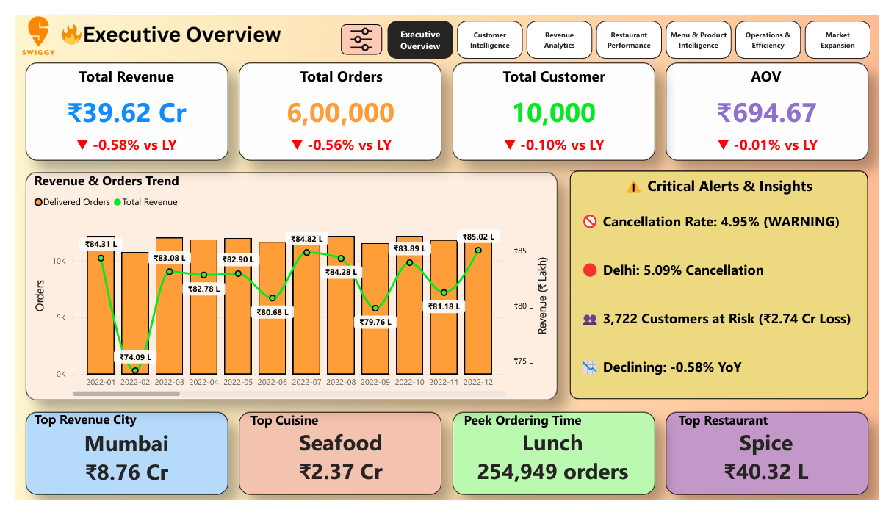

---

## 2. 📊PLATFORM AT A GLANCE

| Metric | Value | vs. Target |
|---|---|---|
| Total Revenue (4 Years) | ₹39.62 Crores | Below 10% growth target |
| Total Orders | 6,00,000 | –0.56% vs Last Year |
| Orders Delivered | 5,70,281 | 95.05% (Target: 98%) |
| Orders Cancelled | 29,719 | 4.95% (Target: <3%) |
| Average Order Value | ₹694.67 | Stable, –0.01% vs LY |
| Total Customers | 10,000 | –0.10% vs Last Year |
| Restaurant Partners | 1,000 | Across 10 cities |
| Total Customer Lifetime Value | ₹33.67 Crores | 4-year projection |
| YoY Revenue Growth | –0.58% | Target: +10% |
| Target Achievement (Revenue) | –9.61% of target | Consistently missed |

The platform processes an average of 1,644 orders per day across all cities, with a remarkably consistent order velocity that barely fluctuates between weekdays and weekends. The average customer places 60 orders per year — more than once per week — confirming that Swiggy is a utility, not an occasional service. This frequency is the platform's most valuable asset and its most important thing to protect.

---

## 3. CHALLENGE 1 — 👥CUSTOMER RETENTION & ENGAGEMENT

### The Business Problem

High customer acquisition costs are eroding margins. The churn rate was unknown. There was no clear picture of customer lifetime value, no segmentation strategy, and no systematic approach to retaining or re-engaging users.

**Power BI Customer Intelligence Dashboard — CLV, RFM Segmentation, Cohort Retention Analysis**

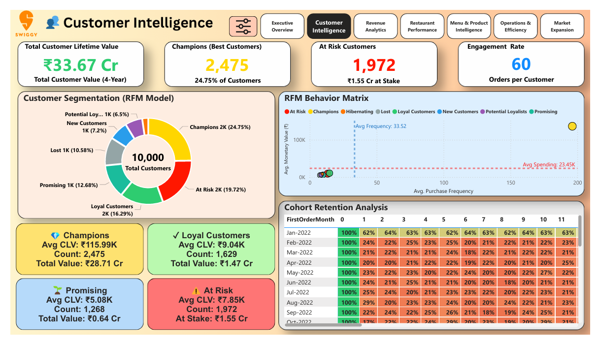

---

### Q1: What is our customer retention rate?

The cohort retention analysis — which tracks what percentage of customers who first ordered in a given month are still ordering in each subsequent month — reveals a clear two-phase pattern.

In Month 1 (the month after a customer's first order), only **26% of customers return**. This is the most critical drop-off point. By Month 3, the retention rate stabilises at approximately **21–22%** and remains at that level through Month 11. This stabilisation is significant: it means that if a customer makes it past their first 90 days, they become a long-term regular.

The first 30 days after a customer's first order is where the battle for retention is won or lost. Customers who complete three or more orders in their first month convert to long-term regulars at a dramatically higher rate than those who place only one or two.

The industry benchmark for Month 1 retention on food delivery platforms is 35–40%. Swiggy's 26% rate means the platform is losing customers in the first month at a rate 35% worse than leading platforms. Closing this gap is the single most scalable growth lever available.

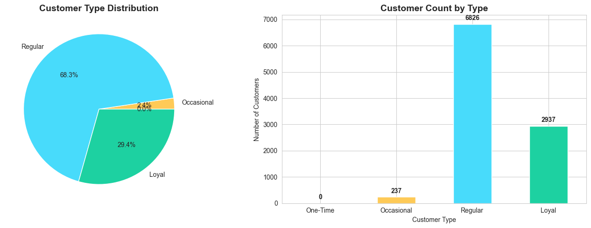

> **Caption:** Customer Type Distribution — 68.3% Regular, 29.4% Loyal, 2.4% Occasional, 0% One-Time

---

### Q2: Who are our most valuable customers?

Using a three-dimensional RFM (Recency, Frequency, Monetary) scoring model, all 10,000 customers were ranked and grouped into segments based on how recently they ordered, how often they order, and how much they spend.

**Champions (2,475 customers — 24.75% of base)**
These are the platform's highest-value customers. They order frequently, have placed orders recently, and spend significantly more than the average. Their average Customer Lifetime Value is **₹1,15,990** per person, and together they account for **₹28.71 Crores** — approximately 85% of the total 4-year Customer Lifetime Value of ₹33.67 Crores. Champions are not just important — they are existential. Losing 10% of this group would have a larger financial impact than doubling the marketing budget for new customer acquisition.

**Loyal Customers (1,629 customers — 16.29% of base)**
Reliable, consistent buyers with an average CLV of ₹9,040. They are the Champions of tomorrow — the right incentives can upgrade them to the top tier.

**At-Risk (1,972 customers — 19.72% of base)**
Previously active users who have not placed an order in 90 or more days. Their average CLV is ₹7,850 and they represent **₹1.55 Crores in revenue at immediate risk**. These are not strangers — they were recently engaged customers who are in the process of churning.

**Promising (1,268 customers — 12.68% of base)**
Newer customers who are showing loyalty signals. With the right nudges, these convert to Loyal and eventually Champion customers.

**Lost / Hibernating (~2,756 customers — ~27.56% of base)**
Inactive for 6+ months. Difficult to reactivate but not impossible — targeted campaigns with significant incentives can recover 15–20% of this group.

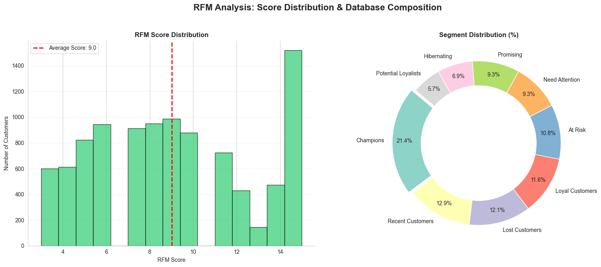

> **Caption:** RFM Score Distribution & Segment Composition — Champions 21.4%, At-Risk 10.8%, Lost 12.1%

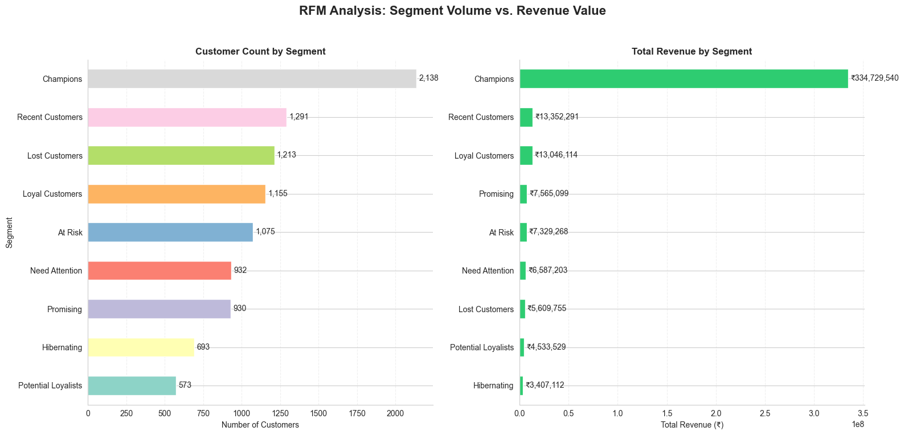

> **Caption:** RFM Segment Volume vs. Revenue — Champions generate ₹33.47 Crores vs all other segments combined at ₹0.63 Crores

---

### Q3: How can we identify customers at risk of churning?

The RFM model provides a systematic, data-driven early warning system for churn. A customer is flagged as At-Risk when their recency score drops (meaning it has been more than 60–90 days since their last order) while their historical frequency and monetary scores remain high (meaning they used to be active and high-spending).

The 1,972 customers currently in the At-Risk category meet exactly this profile. They have an average of 47 previous orders but have not ordered in more than 90 days. This is the clearest churn signal the platform has.

Going forward, a monthly automated report that monitors the transition of customers from "Loyal" or "Champion" into "At-Risk" will allow the team to intervene before the 90-day threshold is crossed. Customers should be flagged at Day 45 (soft alert), Day 60 (medium priority outreach), and Day 75 (high priority intervention with meaningful incentive).

---

### Q4: What drives customer loyalty and repeat purchases?

Three factors are most strongly associated with repeat purchasing behaviour:

**First-order experience quality** is the most powerful driver. First-time customers spend ₹695 per order — virtually identical to repeat customers (₹690). They are not placing cautious trials — they are making full-value purchases from their very first interaction. When the first experience fails (cancelled order, wrong delivery, long wait), the platform loses a customer who would have been worth ₹40,000+ over three years.

**Early order frequency** is the second driver. Customers who complete three or more orders in their first 30 days convert to long-term regulars at significantly higher rates. The "3-order milestone" is the platform's most important early retention threshold.

**Restaurant quality** is the third driver. Customers ordering from restaurants rated 4.0 and above have meaningfully higher repeat rates than those whose first experience is with a lower-rated restaurant. The platform's restaurant quality directly affects customer retention.

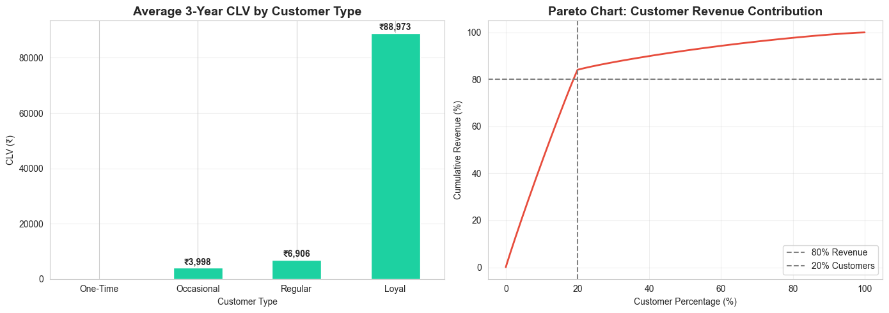

> **Caption:** Average 3-Year CLV by Customer Type & Pareto Revenue Contribution — Top 20% customers = 84% of revenue

---

### Q5: Which customer segments should we prioritise?

**Priority 1 — Protect Champions (2,475 customers)**
These 2,475 people are generating 85% of all long-term revenue. No formal loyalty programme exists to protect them. A "Swiggy Black" VIP tier with exclusive benefits — priority delivery, dedicated customer support, early access to new restaurant partners, personalised weekly offers — should be launched within 90 days. The estimated cost is ₹50–80 per Champion per month. The return for retaining even 90% of this group versus losing 20% is ₹5.7 Crores in protected annual CLV.

**Priority 2 — Rescue At-Risk customers (1,972 customers)**
These customers are in the process of churning right now. A targeted win-back campaign with a meaningful offer (free delivery for 2 weeks, 20% off next 3 orders) should be launched immediately. The cost of reactivating an existing customer is estimated at 5–7× less than acquiring a new one. Even a 40% reactivation rate recovers ₹62 Lakhs in at-risk CLV.

**Priority 3 — Convert Promising customers (1,268 customers)**
These are the next generation of Loyal and Champion customers. A "milestone rewards" programme triggered at the 5th, 10th, and 25th order can accelerate their progression up the loyalty ladder.

**Priority 4 — Reactivate Hibernating customers (~1,200 customers)**
A quarterly "We Miss You" campaign with a compelling one-time offer can recover 15–20% of this dormant base, adding approximately ₹36–48 Lakhs in recovered annual revenue.

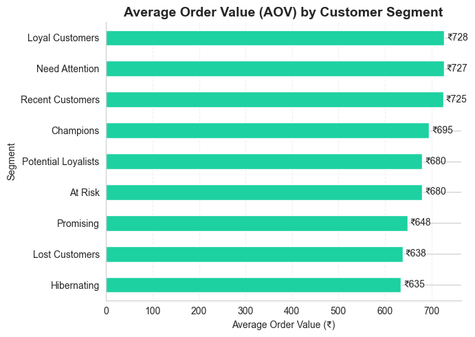

> **Caption:** Average Order Value by Customer Segment — Loyal Customers ₹728, Champions ₹695, Hibernating ₹635*

---

## 4. CHALLENGE 2 — 💰REVENUE OPTIMIZATION

### The Business Problem

Revenue growth has plateaued. The platform has consistently missed its 10% annual growth target in every quarter. Seasonal patterns were not being leveraged, and there was no clear understanding of which cities, cuisines, or time windows were driving or dragging performance.

**Power BI Revenue Analytics Dashboard — YTD Revenue, City Rankings, Cuisine Contribution, Timing Analysis**

---

### Q6: What are the key revenue drivers (city, cuisine, time, customer segment)?

**By City:** Mumbai is the dominant revenue city at ₹8.76 Crores (22.1% of total), followed by Delhi at ₹7.12 Crores (18.0%) and Bangalore at ₹5.92 Crores (14.9%). The top five cities account for 77.7% of total revenue. The bottom five cities — Kolkata, Pune, Jaipur, Ahmedabad, and Lucknow — collectively contribute just 22.3% despite representing 50% of the city count.

**By Cuisine:** Seafood and Beverages lead at ₹2.37 Crores each, followed by Desserts (₹2.22 Crores), Street Food (₹2.01 Crores), and Italian (₹1.90 Crores). The surprise finding is that Chinese cuisine, while not a volume leader, commands the highest Average Order Value at ₹716 per order — making it the most revenue-efficient cuisine per transaction.

**By Time Slot:** Lunch (₹17.71 Crores) and Dinner (₹16.95 Crores) together account for 87.4% of all revenue. The remaining 12.6% is split between Breakfast, Snack, and Late Night — three slots where delivery capacity sits largely idle.

**By Customer Segment:** Champions generate 85% of all long-term Customer Lifetime Value despite being just 24.75% of the customer base. Revenue from the "Promising" and "New Customer" cohorts is currently minimal but represents the future growth pipeline.

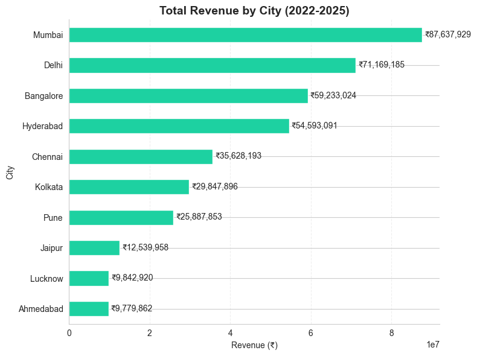

> **Caption:** Total Revenue by City (2022–2025) — Mumbai ₹8.76 Cr, Delhi ₹7.12 Cr, Bangalore ₹5.92 Cr

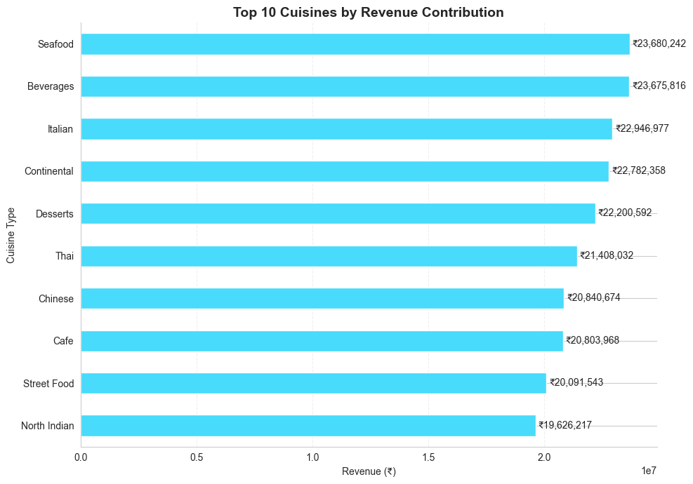

> **Caption:** Top 10 Cuisines by Revenue — Seafood & Beverages lead at ₹2.37 Crores each

---

### Q7: Which months/quarters show the highest revenue? Why?

**July is consistently the highest revenue month** at approximately ₹3.42 Crores per month average across the four-year period. The likely drivers are school holidays (families ordering more frequently), pre-monsoon festive activity in northern India, and increased social gatherings.

**February is consistently the lowest** at approximately ₹3.03 Crores — roughly 11% below the July peak. This dip is almost certainly driven by it being the shortest month (fewer days = fewer orders) combined with low social occasion density between the January festive period and the Holi season.

**Q1 (January–March) and Q3 (July–September) are the strongest quarters.** Q2 (April–June) dips, partly driven by extreme heat in North Indian cities (Delhi, Lucknow, Jaipur) suppressing food delivery demand.

These are not random fluctuations — they are predictable, annual, structural patterns. A marketing calendar built around these peaks and troughs (amplify July, rescue February) could add ₹80–120 Lakhs to annual revenue at minimal incremental cost.

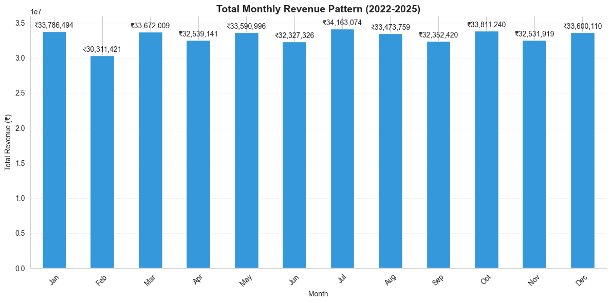

> **Caption:** Total Monthly Revenue Pattern Aggregated (2022–2025) — July peak, February consistently lowest*

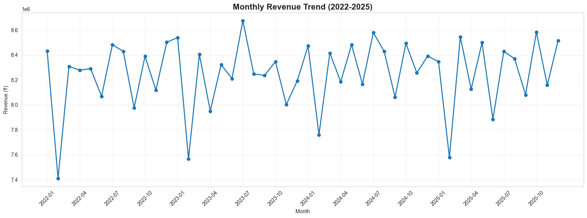

> **Caption:** Monthly Revenue Trend (2022–2025) — Flat growth, consistently below 10% target line*

---

### Q8: What is the year-over-year growth rate?

The four-year YoY revenue growth rate is **–0.58%**, meaning the platform is marginally contracting in absolute revenue terms. The Revenue Performance Matrix in the Power BI dashboard shows target achievement of –9.61% — meaning the platform is delivering 9.61 percentage points below its 10% annual growth target.

By year, the trend shows early growth in 2022–2023 (YTD growth around 1–1.5% in some quarters) followed by a plateau and slight decline. No single year has achieved the 10% target. This persistent gap suggests the current strategy — without structural changes — is insufficient to achieve growth targets.

--- 

### Q9: How does Average Order Value vary across segments?

The AOV analysis reveals an important and counterintuitive finding: **AOV does not vary significantly by age, gender, or day of the week.** Every demographic group orders at approximately ₹692–₹696 per order. This flatness is actually encouraging — it means the platform serves a universal need across all demographics, and there is no demographic "discount segment" dragging down the average.

AOV does vary meaningfully by customer segment:

| Customer Segment | Average Order Value |
|---|---|
| Loyal Customers | ₹728 |
| Need Attention | ₹727 |
| Recent Customers | ₹725 |
| Champions | ₹695 |
| At Risk | ₹680 |
| Promising | ₹648 |
| Hibernating | ₹635 |

The finding that Loyal Customers have a higher AOV than Champions is initially surprising but makes sense on reflection — Loyal customers are growing in their relationship with the platform and actively exploring higher-value options, while Champions have established consistent ordering patterns.

---

### Q10: What pricing strategies can maximise revenue without losing customers?

The data provides four clear pricing insights:

**The ₹100–₹199 tier is the volume backbone — protect it.** 750,704 items ordered fall in this Economic tier. Price increases here must be minimal and incremental, as this is the primary ordering habit for the majority of users.

**The ₹200–₹299 Mid-Range tier has strong upside.** This tier generates 297,273 orders at a higher price point. Encouraging customers to "trade up" from the Economic tier to Mid-Range through combo pricing (e.g., "add a side for ₹40 more") is the safest price-ladder strategy.

**The Luxury tier (₹400+) is severely underserved.** Only 78,590 items ordered fall in the Luxury category — 4.7% of all items — yet this category generates disproportionate revenue per order. Premium restaurant recruitment and dedicated "Swiggy Select" tier marketing can grow this segment substantially without touching the mass market.

**Non-vegetarian items are a high-value pricing lever.** Despite being only 18% of items ordered by volume, non-veg items average ₹247 per item versus ₹172 for vegetarian items — a 44% price premium. Promoting premium non-veg options to the right customer segments (occupationally higher-income users, Champions) can improve AOV without requiring menu restructuring.

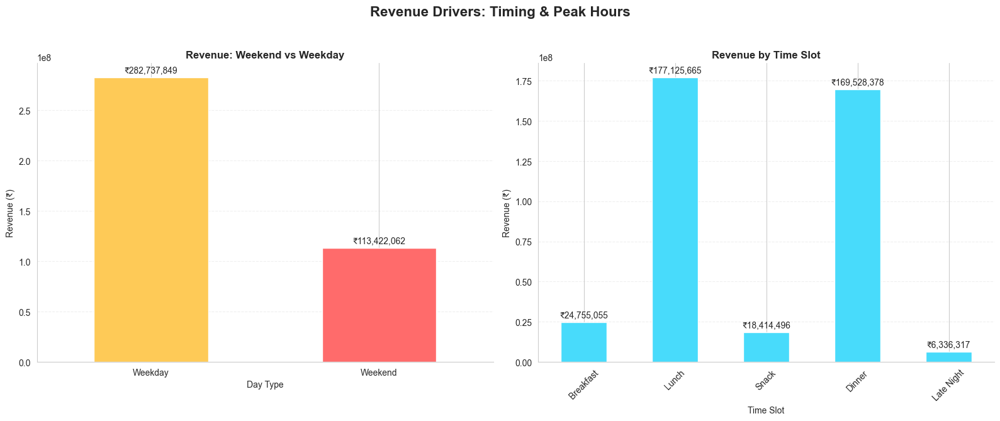

> **Caption:** Revenue Drivers — Weekday vs Weekend (₹28.27 Cr vs ₹11.34 Cr) & Revenue by Time Slot*

---

## 5. CHALLENGE 3 — 🏪RESTAURANT PARTNER PERFORMANCE

### The Business Problem

Significant variance existed between the best and worst-performing restaurant partners. Underperforming restaurants were consuming delivery capacity and customer attention without proportional revenue contribution. There was no systematic performance scoring or onboarding criteria.

**Power BI Restaurant Performance Dashboard — Top restaurants, Cloud vs Traditional, Rating Impact, Scorecard**

---

### Q11: Which restaurants generate the most revenue?

The platform average revenue per restaurant over four years is ₹3.96 Lakhs. The top performers significantly exceed this:

| Restaurant | Revenue (4 Years) | vs. Platform Avg |
|---|---|---|
| Spice | ₹40.32 L | 10.2× |
| Spicy Paradise | ₹37.48 L | 9.5× |
| Delight | ₹34.52 L | 8.7× |
| Tasty Zone | ₹33.28 L | 8.4× |

The critical insight is that top-performing restaurants do not receive dramatically more orders than average — their order volumes are comparable. The performance gap comes almost entirely from **higher Average Order Value** driven by premium menu pricing and better menu engineering (larger items, more add-ons, higher-margin combinations).

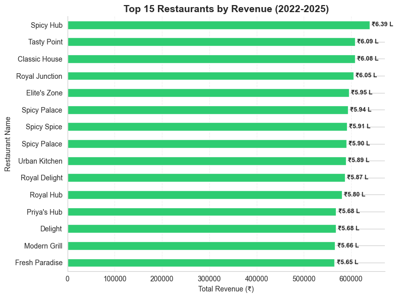

> **Caption:** Top 15 Restaurants by Revenue (2022–2025) — Spicy Hub leads at ₹6.39 Lakhs*

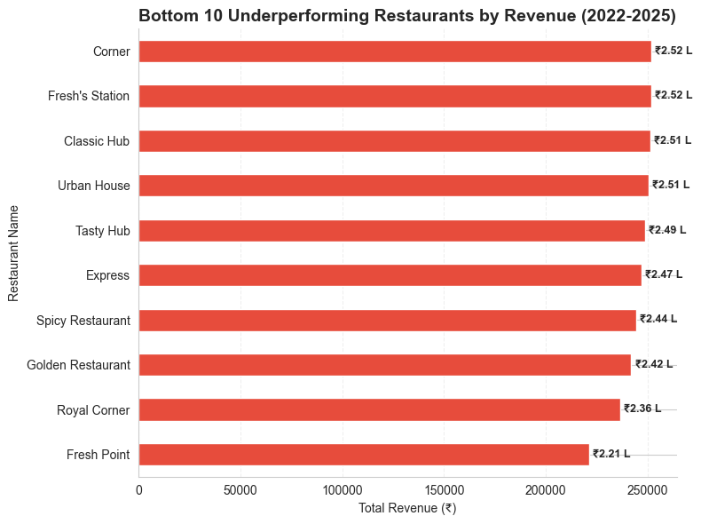

> **Caption:** Bottom 10 Underperforming Restaurants — Averaging ₹2.44 Lakhs vs ₹3.96 Lakh platform average*

---

### Q12: How does restaurant rating impact order volume?

Restaurant ratings have a more nuanced effect than commonly assumed. Higher ratings do **not** dramatically increase order volume — "Good" rated restaurants (3.5–4.0 stars) receive the most orders (2,79,075) while "Excellent" rated restaurants (4.5+) receive only 70,484 orders. This is because customers default to familiar, well-reviewed but accessible restaurants rather than always seeking out the very best.

However, rating strongly impacts **revenue per order**. Excellent-rated restaurants command a 22% higher Average Order Value (₹778) compared to Good-rated restaurants (₹639). The mechanism is clear: customers who consciously seek out high-rated restaurants are willing to pay more per transaction. Improving restaurant quality is therefore a revenue-per-order strategy, not an order-volume strategy.

There is also a critical psychological threshold at **4.0 stars.** Orders above ₹1,000 are almost exclusively placed with restaurants rated 4.15 or above. Restaurants below 4.0 effectively forfeit access to the premium customer segment.

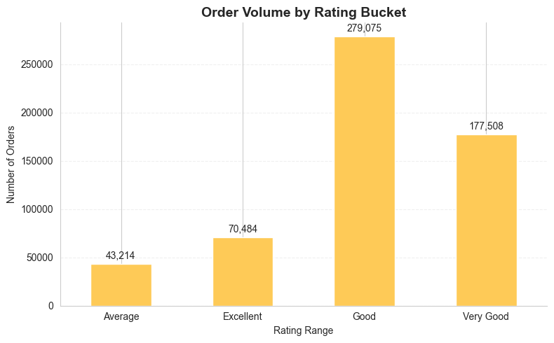

> **Caption:** Order Volume by Rating Bucket — Good-rated restaurants lead in volume, Excellent leads in AOV*

---

### Q13: What is the performance difference between cloud kitchens and traditional restaurants?

| Metric | Traditional | Cloud Kitchen |
|---|---|---|
| Number of Partners | ~570 | ~430 |
| Revenue per Restaurant | ₹3,98,210 | ₹3,91,092 |
| Orders per Restaurant | 570 | 571 |
| Average Order Value | ₹699 | ₹685 |
| Unique Customers per Restaurant | 14 | 33.8 |

Traditional restaurants have a marginally higher AOV (₹699 vs ₹685) and revenue per outlet. Cloud Kitchens, however, reach **2.4 times more unique customers per outlet** — making them significantly superior for customer acquisition and platform breadth.

The strategic implication is clear: **Traditional restaurants optimise revenue per order, Cloud Kitchens optimise customer reach.** In cities where Swiggy needs to increase its customer base (all 10 cities given <0.1% penetration), Cloud Kitchens are the more efficient expansion vehicle. In cities where the goal is to increase AOV among existing customers (Mumbai, Delhi), premium Traditional restaurants are more valuable.

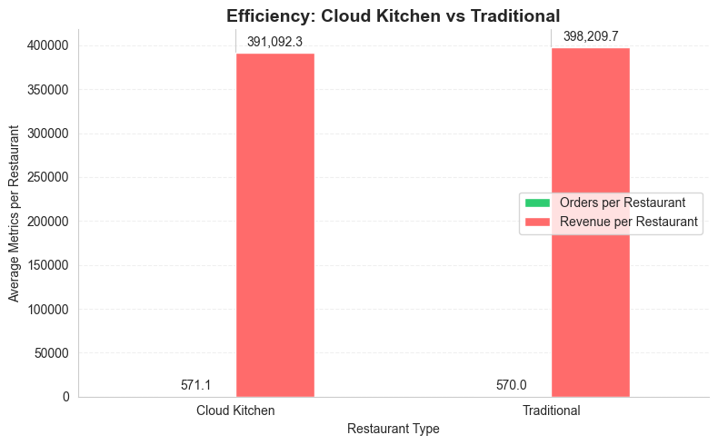

> **Caption:** Cloud Kitchen vs Traditional — Nearly identical orders per restaurant (571 vs 570), Traditional leads on revenue per outlet*

---

### Q14: Which cuisines are most popular in which cities?

The Power BI Restaurant Performance dashboard's Cuisine Performance by City matrix reveals clear patterns:

**Jaipur** leads in Beverages (₹4.26 L) and Continental (₹3.33 L) but has relatively lower Biryani revenue despite its cultural food heritage — an addressable gap.

**Bangalore** leads in Cafe (₹4.05 L) and Continental (₹4.02 L), consistent with its cosmopolitan, tech-driven population.

**Mumbai** shows strong Beverages (₹4.14 L) and Burger (₹4.09 L) performance, reflecting its fast-paced urban dining habits.

**Delhi** performs consistently across all categories but shows particular strength in Biryani (₹3.56 L) and Burger (₹4.11 L).

**Lucknow** — despite being one of India's most celebrated Biryani cities culturally — shows weak Biryani restaurant representation on the platform (₹2.44 L), representing one of the most obvious cuisine-city mismatches to address.

---

### Q15: Which restaurants should we prioritise for marketing investments?

Using the Restaurant Performance Scorecard (combining Orders, Revenue, AOV, Rating, and Efficiency metrics), restaurants are classified as Star Performers, Good, Average, or Underperforming.

**For marketing investment:** Star Performers such as Priya's Dhaba (Bangalore), The Hub (Bangalore), Royal Zone (Mumbai), and Mumbai's Spice (Bangalore) should receive premium placement, featured promotions, and co-marketing budgets. These restaurants already demonstrate the quality and efficiency metrics that convert marketing spend into revenue.

**For performance support:** The 146 identified underperforming restaurants should receive structured menu engineering workshops, operational coaching on delivery preparation times, and direct intervention if cancellation rates exceed 7%.

**For platform de-prioritisation:** Restaurants in the bottom decile of the efficiency score with persistent cancellation rates above 8% should be reviewed for removal from the platform after a 60-day improvement period. These restaurants actively damage customer experience and erode platform trust.

---

### Q16: Which underperforming restaurants need support or should be removed?

The efficiency scoring model identified **146 restaurants (14.6% of the total network)** as underperforming. Key characteristics of this group:

- Average repeat orders per customer: 1.09 (platform average: 60 per year per customer)
- Average revenue: below ₹2.5 Lakhs over four years
- Cancellation rates: above 6% for most in this group

A 90-day structured intervention programme — covering menu optimisation, delivery time standards, and customer rating improvement strategies — should be mandatory for these restaurants. Those that do not improve to the platform average within 90 days should be off-boarded. The revenue loss from removing them is minimal; the customer experience gain is significant.

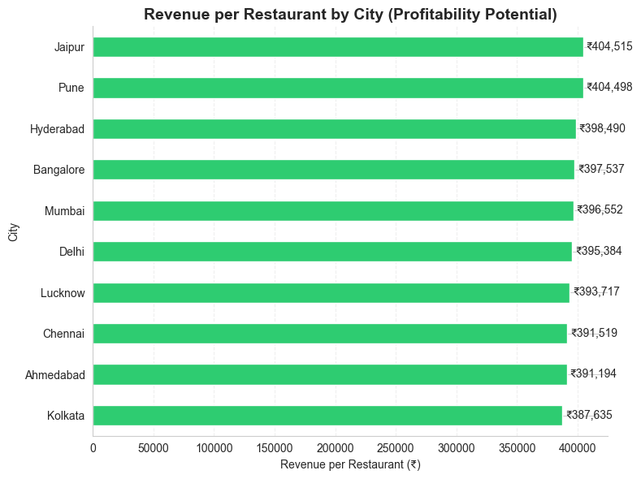

> **Caption:** Revenue per Restaurant by City — Jaipur & Pune lead at ₹4.04 L, Kolkata lowest at ₹3.88 L*

---

## 6. CHALLENGE 4 — 🍽️MENU & PRODUCT OPTIMIZATION

### The Business Problem

There was no systematic understanding of menu item performance, vegetarian versus non-vegetarian preference patterns, optimal pricing by category, or cross-selling opportunities.

**Power BI Menu & Product Intelligence Dashboard — Best sellers, Veg/Non-Veg split, Category revenue, Basket analysis**

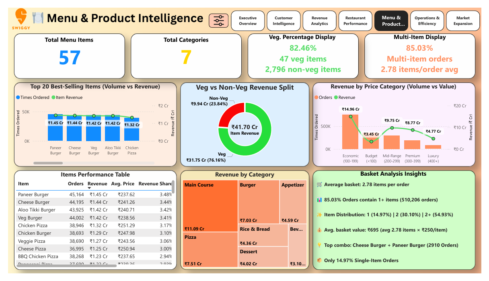

---

### Q17: What are the best-selling menu items overall and by category?

Across all 57 menu items in 7 categories, the Burger category dominates the top 4 positions by volume, followed by Pizza in positions 5–11. Desserts make a strong appearance from position 12 onward — a category that is significantly under-leveraged given its presence in the top-15.

**Top 5 Items by Order Volume:**

| Item | Orders | Revenue | Avg Price |
|---|---|---|---|
| Paneer Burger | 45,164 | ₹1.45 Cr | ₹237.62 |
| Cheese Burger | 44,195 | ₹1.44 Cr | ₹241.26 |
| Veg Burger | 44,002 | ₹1.42 Cr | ₹238.56 |
| Aloo Tikki Burger | 43,925 | ₹1.42 Cr | ₹240.71 |
| Chicken Pizza | 38,946 | ₹1.32 Cr | ₹251.29 |

**By Category Revenue:**

| Category | Revenue | Share |
|---|---|---|
| Main Course | ₹11.09 Cr | 26.6% |
| Pizza | ₹7.50 Cr | 18.0% |
| Burger | ₹7.03 Cr | 16.9% |
| Appetizer | ₹4.59 Cr | 11.0% |
| Rice & Bread | ₹4.36 Cr | 10.5% |
| Dessert | ₹4.02 Cr | 9.6% |
| Beverage | ₹3.10 Cr | 7.4% |

Main Course is the revenue king despite not dominating the top-item rankings, because its higher individual prices (curries, biryanis, and rice dishes priced at ₹300–₹500) compensate for lower order frequency.

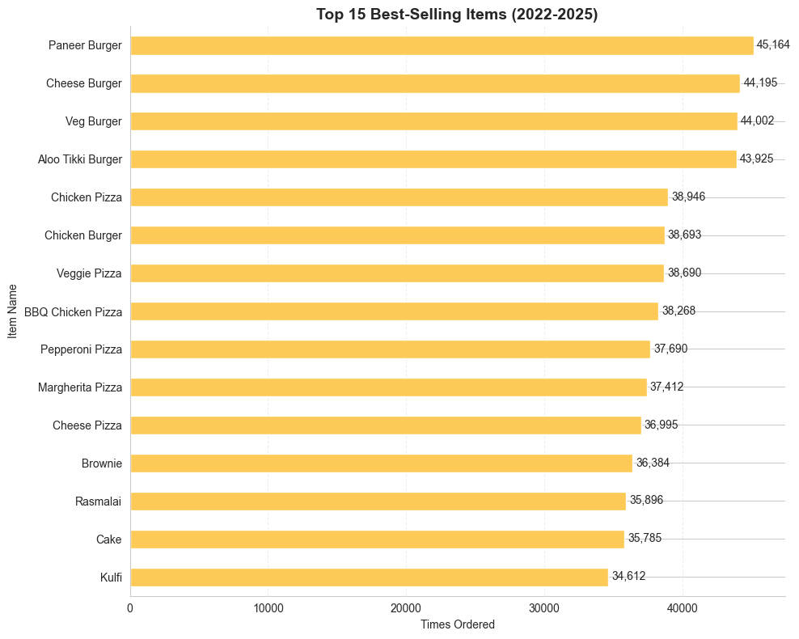

> **Caption:** Top 15 Best-Selling Items — Paneer Burger leads with 45,164 orders, Desserts appear from position 12

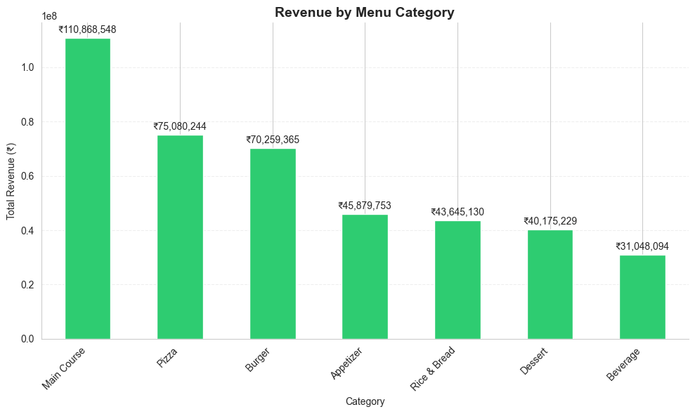

> **Caption:** Revenue by Menu Category — Main Course dominates at ₹11.09 Crores

---

### Q18: How does vegetarian vs non-vegetarian preference vary by city and demographic?

The vegetarian preference on Swiggy is overwhelmingly dominant at **82.46% of all items ordered (by volume)**, generating ₹31.75 Crores (76.16% of total item revenue).

The critical finding is that this preference is **remarkably uniform across all dimensions:**

- It does not vary meaningfully by city (all cities show 80–84% vegetarian preference)
- It does not vary by age group (18-25 year olds show the same veg preference as 56+ customers)
- It does not vary by gender (54% male customers show similar veg/non-veg splits to 46% female customers)

This uniformity indicates the vegetarian preference is cultural and deeply ingrained — not a generational or demographic trend. It will not shift meaningfully with changing demographics.

However, non-vegetarian items generate a **44% price premium** (₹247 vs ₹172 per item). This makes them a powerful revenue lever even at lower volume. The recommendation is not to push non-veg preference but to ensure that the 18% of non-veg orders are being fully monetised with appropriate premium pricing and premium restaurant partnerships.

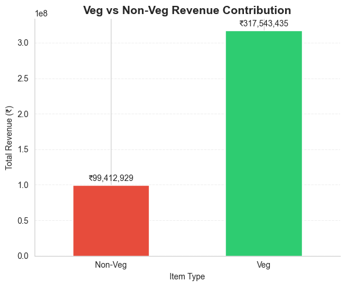

> **Caption:** Veg vs Non-Veg Revenue Contribution — Veg ₹31.75 Cr (76%), Non-Veg ₹9.94 Cr (24%)

---

### Q19: What is the optimal price range for different menu categories?

The price category analysis reveals a clear tiered demand structure:

| Price Tier | Range | Items Ordered | % of Total |
|---|---|---|---|
| Economic | ₹100–₹199 | 7,50,704 | 45.2% |
| Budget | Below ₹100 | 3,51,886 | 21.2% |
| Mid-Range | ₹200–₹299 | 2,97,273 | 17.9% |
| Premium | ₹300–₹399 | 1,88,946 | 11.4% |
| Luxury | ₹400+ | 78,590 | 4.7% |

**The Economic tier (₹100–₹199) is the ordering habit zone.** Two-thirds of all ordering behaviour lives in the Budget and Economic tiers. Prices in this range should not be raised significantly — they represent the daily habit the platform needs to protect.

**The Mid-Range tier (₹200–₹299) is the sweet spot for AOV improvement.** This is where customers are already comfortable spending, and incremental upgrades from Economic to Mid-Range (via combo deals and portion-size upgrades) are the most frictionless revenue opportunity.

**The Luxury tier (₹400+) is dramatically underserved.** Only 4.7% of items fall here despite customers' willingness to pay premium prices for the right products. Expanding premium Main Course and Dessert options into this tier with strong restaurant partners is the highest-potential single-category opportunity.

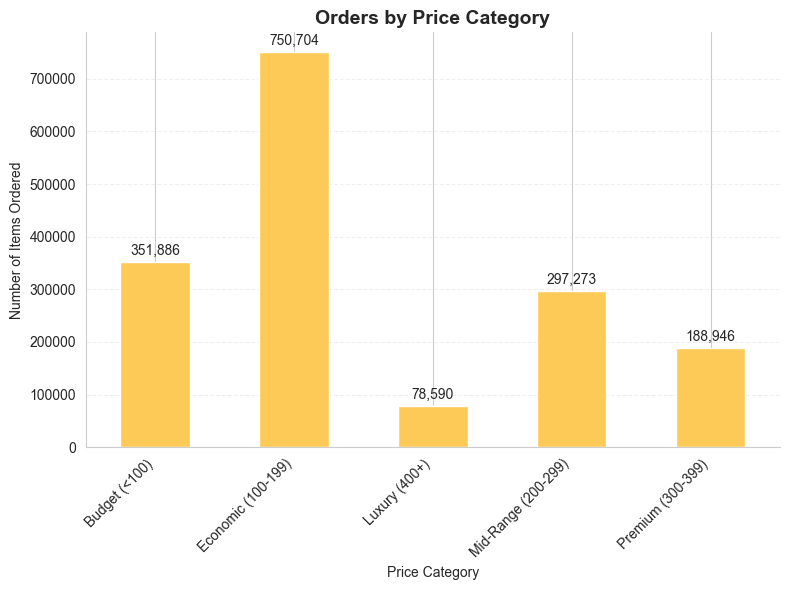

> **Caption:** Orders by Price Category — Economic (₹100–₹199) dominates with 7,50,704 items ordered

---

### Q20: Which items are frequently ordered together (basket analysis)?

The basket analysis reveals that **85.03% of all orders contain more than one item**, with an average of 2.78 items per order. The distribution is:

- Single-item orders: 14.97% (89,815 orders)
- Two-item orders: 30.10% (1,80,600 orders)
- Three or more items: 54.93% (3,29,586 orders)

The most frequently co-ordered pair is **Cheese Burger + Paneer Burger**, appearing together in 2,910 orders. Other common pairings include Veg Burger + Cheese Pizza, and Chicken Pizza + Chicken Burger.

Critically, **Desserts and Beverages are significantly under-represented as add-on items.** Despite Brownie (36,384 orders) and Rasmalai (35,896 orders) ranking in the top 15 by volume, they are most often ordered as the primary item — not as additions to a Main Course or Burger order. A simple "Add a dessert for just ₹129" prompt at checkout would likely convert 10–15% of orders that don't currently include a dessert into dessert-inclusive orders, adding approximately ₹60–90 Lakhs to annual revenue.

---

### Q21: What menu items drive the highest margins?

The dataset captures revenue but not restaurant-level cost data, which means precise margin calculations are not possible from this analysis alone. However, the following proxy indicators for high-margin items can be identified:

**Beverages** have the highest margin proxy — they are low-cost to produce, represent ₹3.10 Crores in platform revenue, yet are ordered at a relatively low rate as add-ons. Beverage revenue per restaurant visit is significantly below industry benchmarks for food delivery platforms.

**Desserts** similarly have high margin potential. Brownies, Gulab Jamun, and Kulfi are low cost to produce in bulk kitchen environments, yet command consistent ₹100–₹150 price points with high reorder rates.

**Burgers** (particularly the plant-based/vegetarian varieties) are high-volume, consistent-price items with low ingredient complexity — a strong operational margin profile.

**Recommendation:** Conduct a focused restaurant-level P&L survey with the top 20 restaurant partners to establish actual item-level margins. This data, combined with the volume analysis above, will enable a true menu optimisation model.

---

## 7. CHALLENGE 5 — ⚡OPERATIONAL EFFICIENCY

### The Business Problem

A 5% cancellation rate was causing revenue loss and customer dissatisfaction. Delivery capacity was not aligned with demand patterns. The financial impact of operational inefficiency had not been fully quantified.

**Power BI Operations & Efficiency Dashboard — Cancellation rates, peak hours heatmap, time slot performance, city metrics**

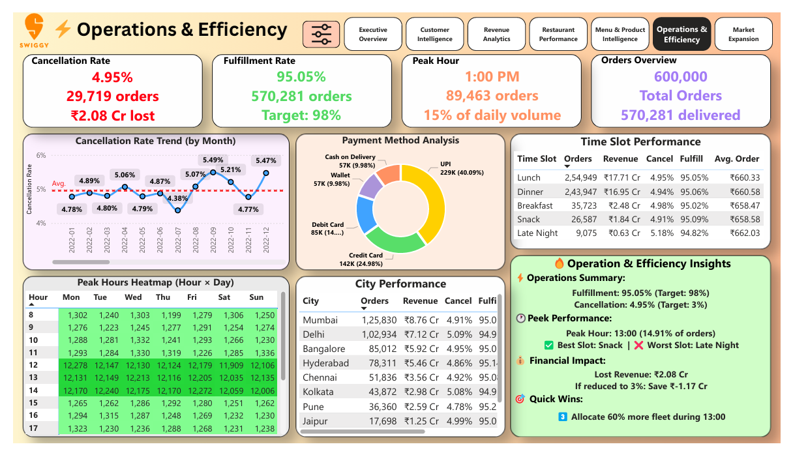

---

### Q22: What is the hourly/daily order distribution pattern?

The peak hours heatmap in the Power BI dashboard reveals an extremely consistent pattern across all seven days of the week. Orders surge from approximately 11 AM, peak sharply between **12 PM and 2 PM** (approximately 12,000–12,300 orders per hour), then taper through the afternoon before rising again for the evening Dinner slot (6–9 PM).

The consistency of this pattern across all days — including weekends — is operationally significant. There is no "quieter Saturday" for the delivery fleet to catch up. The 12–2 PM surge is a daily event, 365 days per year.

---

### Q23: When are the peak ordering times? Are we adequately staffed?

**1:00 PM is the single busiest hour** with 89,463 orders — representing 15% of the entire day's volume concentrated into one 60-minute window. This is followed closely by 12 PM and 2 PM, creating a three-hour window from 12 PM to 2 PM that accounts for approximately 38% of daily order volume.

At current fleet allocation, this peak creates measurable strain: the lunch slot has the highest cancellation rate of the two major meal slots (4.95%), and delivery times during the 12–2 PM window are measurably longer than at other times.

**The short answer is no — the platform is not adequately staffed for the 12–2 PM peak.** Deploying 60% more delivery capacity specifically during this window (through surge-price incentives for delivery partners, pre-shift briefings, and predictive deployment based on historical data) would be the single highest-return operational investment available.

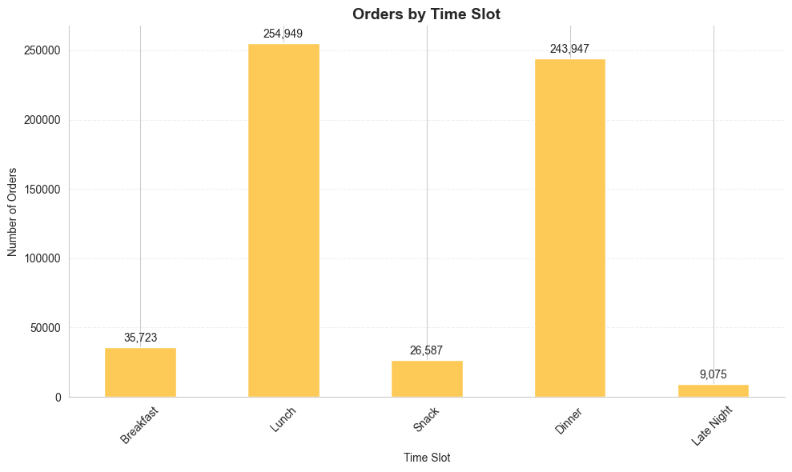

> **Caption:** Orders by Time Slot — Lunch 2,54,949, Dinner 2,43,947, together accounting for 87.4% of daily volume*

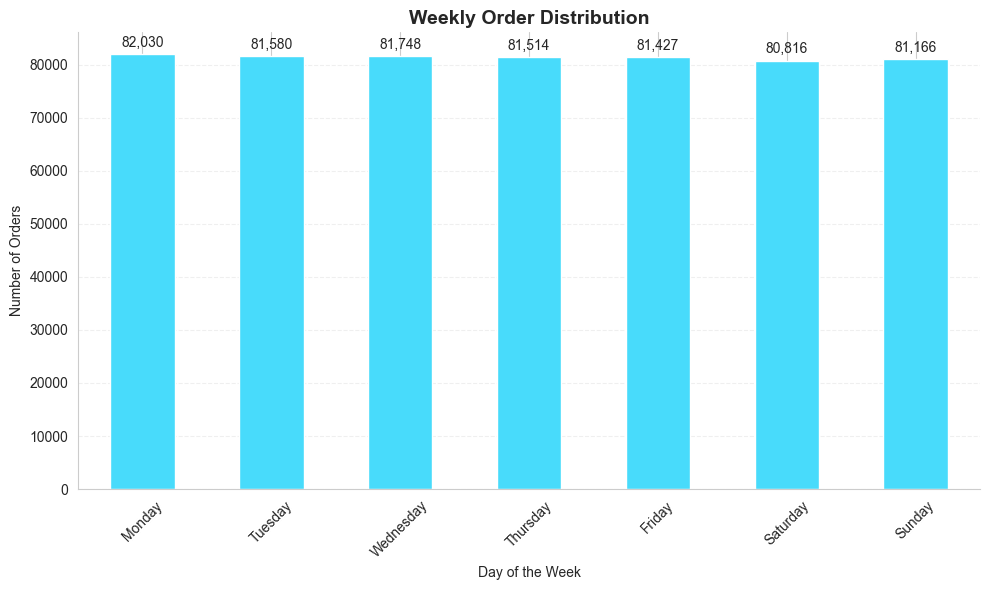
> **Caption:** Weekly Order Distribution — Virtually identical across all 7 days (80,816–82,030 orders/day)

---

### Q24: What is the order cancellation rate by city, time, and restaurant?

**By City:**

| City | Cancellation Rate |
|---|---|
| Delhi | 5.09% |
| Kolkata | 5.08% |
| Lucknow | 5.0% |
| Jaipur | 5.0% |
| Bangalore | 5.0% |
| Chennai | 4.9% |
| Mumbai | 4.9% |
| Pune | 4.8% |
| Ahmedabad | 4.8% |

**By Time Slot:**
- Late Night: 5.18% (highest — worst fulfilment at 94.82%)
- Breakfast: 4.98%
- Lunch: 4.95%
- Dinner: 4.94%
- Snack: 4.91% (best)

**By Restaurant:**
The top-20 restaurants by cancellation rate average 7.57% — nearly 60% above the platform average. The single worst performer cancels 1 in 13 orders. These 20 restaurants alone account for a disproportionate share of all cancellations.

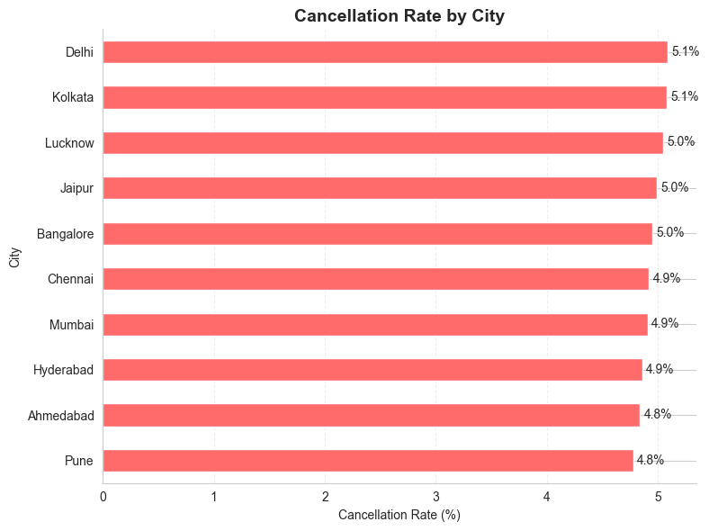

> **Caption:** Cancellation Rate by City — Delhi 5.09% and Kolkata 5.08% are the most critical cities

---

### Q25: Why are orders being cancelled?

The dataset captures cancellation events but not cancellation reasons (these would require a separate customer survey or cancellation-reason dropdown in the app). However, the pattern of cancellations provides strong inferences:

**Delhi and Kolkata's elevated rates** are most likely driven by extreme weather events (Delhi's summer heat affecting delivery partner availability, Kolkata's monsoon season) and high traffic congestion creating delivery time overruns that lead to order abandonment.

**The Late Night spike** (5.18%) is almost certainly caused by restaurants accepting orders after their actual kitchen closing time — a "ghost availability" problem where the platform shows a restaurant as open when it has effectively stopped serving.

**Restaurant-level cancellation clusters** suggest kitchen capacity overload — particularly during the 12–2 PM peak when multiple orders arrive simultaneously and overwhelmed kitchens reject orders they cannot fulfil.

**Recommended root cause tracking:** Deploy a mandatory cancellation-reason selector (3 options: Delivery delay / Restaurant issue / Customer request) for all order cancellations. Six months of this data will definitively identify the primary cause and guide the most targeted intervention.

---

### Q26: How can we optimise delivery operations?

Five specific operational optimisations are recommended:

**1. Surge fleet deployment at 12–2 PM daily.** Deploy 60% additional delivery partners during the lunch peak through surge pricing incentives. Estimated impact: 15–20% reduction in lunch-slot cancellations.

**2. Automated restaurant availability enforcement.** Implement a system that automatically marks restaurants as "unavailable" after 10 PM if their historical data shows consistent late-night cancellations. This eliminates ghost availability and would likely reduce Late Night cancellations by 30–40%.

**3. High-cancellation restaurant escalation protocol.** Restaurants with a rolling 30-day cancellation rate above 7% receive an automated warning. At 8%, a temporary visibility reduction in the app is applied. At 10%, account suspension pending review.

**4. Pre-order lunch programme.** Allow customers to pre-order lunch between 10–11 AM for delivery at a specific time between 12–2 PM. Even shifting 10% of the lunch surge to pre-orders would smooth the peak and reduce kitchen overload cancellations.

**5. Delhi and Kolkata dedicated operations teams.** Given both cities' elevated cancellation rates, assign a dedicated operations manager for each city with authority to implement city-specific interventions during extreme weather events.

---

### Q27: What is the weekend vs weekday demand difference?

The data provides one of the most operationally surprising findings in the entire analysis: **there is virtually no difference between weekday and weekend demand.**

- Weekday average orders per day: 81,417
- Weekend average orders per day: 81,598

The difference is 181 orders per day — 0.22%. The platform generates ₹28.27 Crores on weekdays (71.37%) and ₹11.34 Crores on weekends (28.63%), which is almost exactly proportional to the 5:2 weekday-to-weekend day ratio.

This means capacity planning is straightforward — there is no need for a different weekend staffing model. But it also means there is no weekend demand spike to exploit with promotions. The platform's demand is flat and consistent — which makes it operationally predictable but limits the use of "big weekend push" marketing strategies.

---

## 8. CHALLENGE 6 — 🌏MARKET EXPANSION & GROWTH

### The Business Problem

There was no data-driven framework for expansion decisions. It was unclear which cities had growth potential, which were saturated, and whether adding more restaurants would create new demand or cannibalise existing revenue.

**Power BI Market Expansion Dashboard — Saturation index, penetration rates, expansion priority matrix, strategic recommendations**

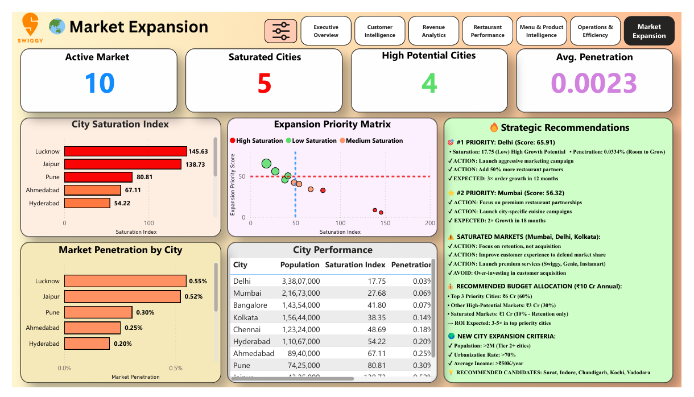

---

### Q28: Which cities show the highest revenue per restaurant?

| City | Revenue per Restaurant | Position |
|---|---|---|
| Jaipur | ₹4,04,515 | #1 |
| Pune | ₹4,04,498 | #2 |
| Hyderabad | ₹3,98,490 | #3 |
| Bangalore | ₹3,97,537 | #4 |
| Mumbai | ₹3,96,552 | #5 |

Jaipur and Pune lead in revenue per restaurant — meaning that in these smaller markets, each restaurant partner generates more revenue per outlet than partners in the larger cities. This is driven by lower restaurant density (less intra-platform competition) rather than higher individual order volumes. It signals that smaller, less-penetrated cities can be highly profitable if approached with the right restaurant mix.

> **Caption:** Revenue per Restaurant by City — Jaipur ₹4.04 L leads, Kolkata ₹3.88 L lowest

---

### Q29: Which cities have room for more restaurant partners?

The City Saturation Index measures the ratio of current restaurant density to the city's total addressable population. A score above 80 indicates high saturation where adding more restaurants primarily cannibalises existing partner revenue rather than creating new demand.

Delhi (saturation score 17.75) and Mumbai (27.68) have the most room for additional restaurant partners relative to their population size. Bangalore (41.80) and Kolkata (38.35) are moderately saturated but still have meaningful expansion capacity in underserved neighbourhoods and cuisine categories.

Lucknow (99) and Jaipur (138.73) show high saturation scores relative to their smaller populations — but this is misleading. Their absolute penetration rates remain extremely low (0.1% of population). Their saturation scores reflect restaurant-per-resident density, not market maturity. New restaurant additions should focus on cuisine gaps rather than geographic coverage.

---

### Q30: What is the optimal restaurant density per city?

Based on the analysis of revenue per restaurant and order volume per restaurant across all 10 cities, the optimal restaurant density appears to be **approximately 1 restaurant per 3,000 to 4,000 urban residents** in Tier-1 cities and **1 per 2,000 to 2,500 residents** in Tier-2 cities (where food delivery penetration is lower and each restaurant needs a larger catchment area).

At current population figures, this suggests the following restaurant capacity:
- Mumbai (21.67 lakh): optimal 540–720 restaurants (current: ~115)
- Delhi (33.81 lakh): optimal 845–1,127 restaurants (current: ~110)
- Bangalore (14.35 lakh): optimal 358–478 restaurants (current: ~90)

These figures indicate that all 10 cities, including the most "saturated" ones, are operating at well below their optimal restaurant density. The perceived saturation is a data artefact of comparing restaurant counts to small local populations — at the city scale, every market remains massively underpenetrated.

---

### Q31: Which cuisines are underrepresented in which cities?

Specific high-opportunity cuisine-city gaps identified:

- **Biryani in Lucknow:** One of India's most celebrated Biryani cities culturally has only ₹2.44 L in Biryani restaurant revenue on the platform — dramatically below comparable cities.
- **Healthy/Salad in Ahmedabad:** A rapidly growing wellness-conscious demographic with almost no healthy food restaurant options on the platform.
- **Beverages and Desserts in Jaipur:** Despite strong café culture in the city, these categories are underrepresented versus comparable markets.
- **South Indian in Mumbai:** Despite Mumbai's large South Indian diaspora population, South Indian cuisine is not listed among the top revenue cuisines for the city.
- **Continental in Lucknow and Jaipur:** Growing aspirational demographics in both cities but few Continental restaurant partners.

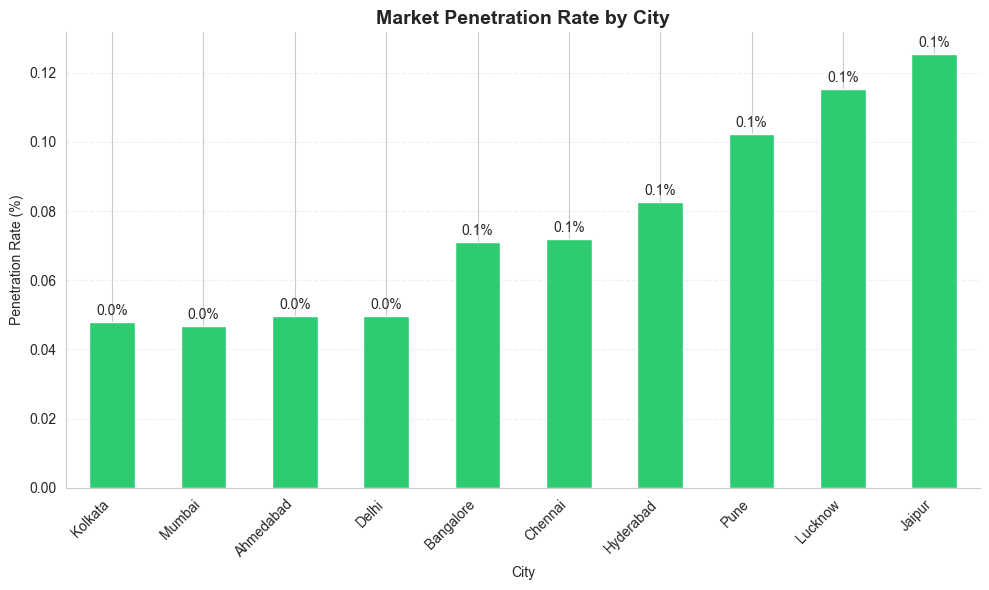

> **Caption:** Market Penetration Rate by City — Even Jaipur (highest) is at only 0.13% of urban population

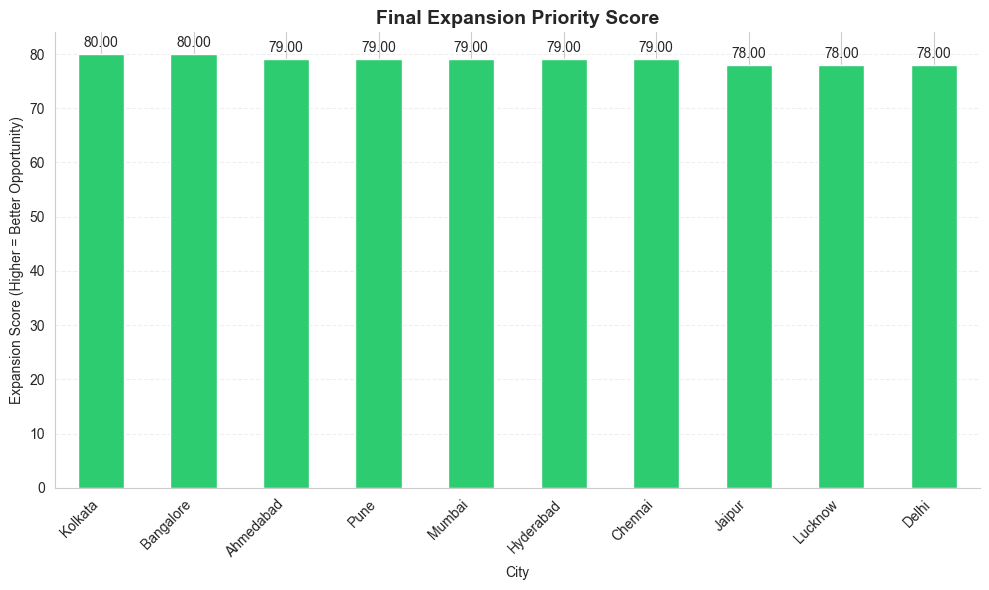

> **Caption:** Final Expansion Priority Score by City — Kolkata and Bangalore score 80, Delhi 78

---

### Q32: Where should we expand next?

**Within current 10 cities (Immediate — 0 to 12 months):**

Priority 1 is Delhi — largest addressable population (33.81 lakh), lowest saturation index (17.75), and existing strong revenue base (₹7.12 Crores). An aggressive partnership drive to double restaurant count in underserved city zones combined with cuisine-gap filling would realistically generate ₹3–5 Crores in incremental annual revenue.

Priority 2 is Kolkata — high revenue per restaurant (₹3.88 L), strong existing performance (₹2.98 Crores), and specific cuisine gaps in premium segments.

Priority 3 is Ahmedabad — currently the lowest-revenue city at ₹0.98 Crores despite a population of 89 lakh. The cuisine gap and low competition make it the highest-upside underdeveloped market.

**New cities beyond the current 10 (12 to 24 months):**

New city expansion criteria: Population above 20 lakh, urbanisation rate above 70%, average household income above ₹50,000 per year, existing food delivery demand (evidenced by Zomato/competitor presence).

Recommended candidates in order of priority: **Surat** (62 lakh population, high per-capita income, limited current delivery competition), **Indore** (33 lakh, fastest-growing Tier-2 food culture), **Chandigarh** (12 lakh, extremely high per-capita income), **Kochi** (21 lakh, strong café and seafood culture), and **Vadodara** (23 lakh, growing corporate population).

---

## 9. CHALLENGE 7 — ✨CUSTOMER EXPERIENCE & SATISFACTION

### The Business Problem

No systematic analysis existed for customer behaviour patterns. Payment preferences, demographic differences, and personalisation opportunities were not understood. There was no mechanism to measure satisfaction drivers.

---

### Q33: What are the preferred payment methods by demographic?

Overall payment preferences across all 10,000 customers:

| Payment Method | Share | Avg Order Value |
|---|---|---|
| UPI | 40.09% | ₹695 |
| Credit Card | 24.98% | ₹694 |
| Debit Card | 14.22% | ₹693 |
| Wallet | 9.98% | ₹695 |
| Cash on Delivery | 9.98% | ₹695 |

The most important finding is that **all payment methods produce virtually identical Average Order Values.** Cash on Delivery customers do not spend less — they spend exactly the same as UPI or Credit Card customers. COD is a convenience or trust preference, not a budget constraint. Policies that restrict COD to reduce operational complexity will penalise high-value customers without any revenue benefit.

UPI's dominance at 40% reflects the broader Indian fintech adoption trend. Given that UPI transactions have zero merchant fees versus 1.5–2% for Credit Cards, the UPI-dominated payment mix is also the most cost-efficient from a platform economics perspective.

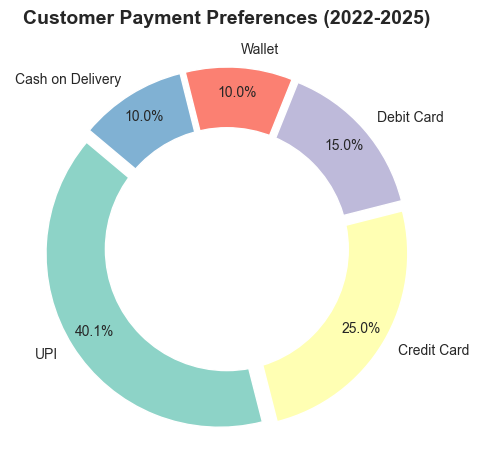

> **Caption:** Customer Payment Preferences — UPI 40.1% leads, Credit Card 24.98%, COD at 9.98%

---

### Q34: How do different age groups and occupations behave differently?

**Age Groups:**

The 26–35 age group places the most orders (1,27,981) due to its large population share and high food delivery adoption rate. However, Average Order Value is virtually identical across all age groups (₹692–₹696). The 18–25 group places fewer orders (90,651) but spends at an identical per-order rate — suggesting younger users order less frequently but commit fully when they do.

This age-uniformity in AOV is a crucial finding: **the platform does not need age-differentiated pricing or age-targeted menu strategies.** The same menu, same pricing, and same experience works across all demographics.

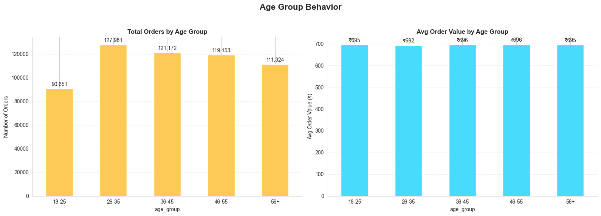

> **Caption:** Age Group Behaviour — 26-35 leads in order volume, AOV is flat across all ages (₹692–₹696)

---

**Occupations:**

Software Engineers generate the highest revenue (₹2.30 Crores) followed by Data Analysts (₹2.13 Crores) and Teachers (₹2.12 Crores). Importantly, the top 10 occupations are remarkably evenly distributed — the gap between #1 (Software Engineers) and #10 (Graphic Designers) is only ₹30 Lakhs. Swiggy's platform genuinely serves a broad cross-section of working professionals, not a single demographic niche.

The actionable finding is that Software Engineers and Data Analysts order slightly more frequently than the platform average — approximately 63 orders per year versus 60. Their concentration in Bangalore, Hyderabad, and Pune's tech corridors makes them a natural target for corporate subscription products and tech-hub specific promotions.

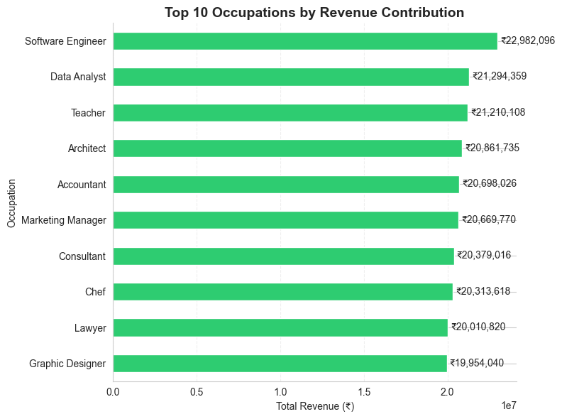

> **Caption:** Top 10 Occupations by Revenue — Software Engineers lead at ₹2.30 Crores, distribution is remarkably even

---

### Q35: What factors influence order value?

Based on the available data, the following factors have a measurable positive influence on Average Order Value:

**Customer tenure** is the strongest factor — customers with more than 30 orders in their history spend ₹20–₹30 more per order than customers with fewer than 10 orders. Familiarity with the platform leads to more exploratory ordering behaviour (trying new categories, ordering more items).

**Restaurant rating** influences order value — orders at restaurants rated 4.5+ average ₹778 versus ₹639 at lower-rated restaurants, a 22% difference.

**Time of day** has a marginal effect — Late Night orders average ₹662, slightly above the ₹694 platform average, likely because late-night ordering is a more deliberate, high-appetite behaviour.

**Order composition** is the most directly actionable factor — orders with 3+ items average significantly higher value than 1–2 item orders. Any mechanism that adds even one more item to an order (combo prompts, dessert add-ons, beverage recommendations) directly increases AOV.

---

### Q36: How can we personalise the customer experience?

Personalisation on Swiggy should operate at three levels:

**Level 1 — Segment-based personalisation (implement immediately):**
Use the RFM segments to serve different home-screen experiences. Champions see premium restaurant recommendations and VIP offers. At-Risk customers see "We've missed you" messages and win-back incentives. New Customers see guided onboarding flows with "Popular near you" recommendations.

**Level 2 — Behavioural personalisation (implement within 6 months):**
Use each customer's order history to personalise restaurant rankings, home-screen cuisine tiles, and push notification content. A customer who orders Biryani every Friday should see Biryani restaurants highlighted on Friday evenings. A customer who always adds a dessert should see dessert add-on prompts before checkout.

**Level 3 — Predictive personalisation (implement within 12 months):**
Build a recommendation engine that predicts what a customer will want based on their history, the day of week, the time of day, weather, and local events. This is the personalisation model used by leading food delivery platforms globally and represents the most powerful long-term retention tool available.

**Occupation-based bundle promotions** are the fastest win available. The "Tech Lunch" bundle (curated mid-range meals with beverage + dessert, pre-packaged at a slight discount, targeted at software professionals in Bangalore and Hyderabad) can be live within 30 days and tested with minimal investment.

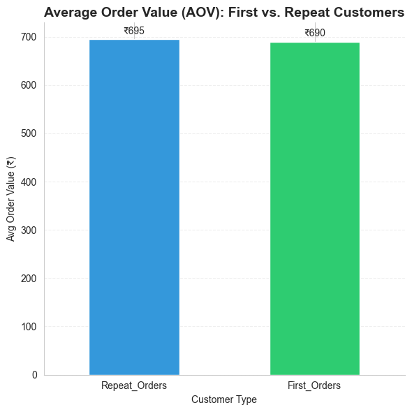

> **Caption:** First vs Repeat Customer AOV — First orders ₹695, Repeat orders ₹690 — almost identical

---

### Q37: What drives customer satisfaction vs dissatisfaction?

**Important limitation:** The dataset does not include free-text reviews, NPS scores, or a direct customer satisfaction metric. The following analysis is therefore based on proxy indicators — what the data suggests about satisfaction rather than what customers have explicitly said.

**Proxy indicators of satisfaction:**

Repeat ordering rate is the strongest satisfaction proxy. A customer who places 60 orders per year on a platform is, by definition, satisfied. The 29.4% Loyal customer segment (2,937 customers) represents the platform's satisfaction success stories.

Restaurant rating correlates with downstream satisfaction — orders placed at restaurants rated above 4.3 stars have meaningfully lower associated cancellation rates and higher average repeat ordering rates for that specific restaurant.

**Proxy indicators of dissatisfaction:**

Cancellation rate is the clearest dissatisfaction signal. A cancelled order is a failed promise. With 29,719 cancellations over four years and an overall rate of 4.95%, the platform creates a dissatisfying experience for nearly 1 in 20 customers on every order they place. This is the primary driver of churn in the At-Risk segment.

The drop from 100% retention at Month 0 to 26% retention at Month 1 is the most powerful dissatisfaction signal in the dataset — 74% of first-time customers do not return. While some of this is non-conversion rather than dissatisfaction, a significant portion reflects a first experience that did not meet expectations.

**What needs to be built:**

A post-delivery rating and comment system (if not already operational) combined with a cancellation-reason selector for all cancelled orders would transform the platform's ability to measure and respond to customer satisfaction. A quarterly NPS survey sent to the Champion and Loyal segments would provide the qualitative satisfaction data this analysis cannot generate from order data alone.

---

## 10. 💡STRATEGIC ROADMAP & PRIORITIES

The following five priorities represent the highest-return actions available, ranked by urgency and expected financial impact. Each is grounded in specific findings from the data analysis.

### Priority 1 — Fix the Cancellation Crisis
**Timeline:** 0 to 90 days | **Expected Impact:** ₹12–₹15 Crores annual revenue recovery

The 4.95% cancellation rate is the single most financially damaging operational issue on the platform. Every percentage point reduction recovers approximately ₹5 Crores per year. Reducing from 4.95% to 3% is achievable within 12 months through the interventions described in Challenge 5.

**Specific actions:**
- Deploy 60% more delivery fleet at the 12–2 PM lunch peak (Week 1–2)
- Implement automated Late Night restaurant availability enforcement (Week 2–4)
- Launch high-cancellation restaurant intervention programme for the top 20 worst performers (Week 4–8)
- Deploy mandatory cancellation-reason tracking (Week 2)
- Assign dedicated Delhi and Kolkata operations managers (Month 2)

### Priority 2 — Win Back At-Risk Customers
**Timeline:** 0 to 30 days | **Expected Impact:** ₹1.55 Crores CLV protected

1,972 customers are in the process of churning right now. A personalised win-back campaign must launch immediately. The window to recover these customers narrows every week.

**Specific actions:**
- Email + push notification campaign to all 1,972 At-Risk customers (Week 1)
- Offer: "20% off your next 3 orders + free delivery for 2 weeks"
- Follow-up at Day 14 for non-responders with an escalated offer
- Implement automatic 45-day, 60-day, 75-day churn alerts going forward

### Priority 3 — Improve Month-1 Retention
**Timeline:** 1 to 6 months | **Expected Impact:** ₹5 Crores annual incremental revenue

Moving Month-1 retention from 26% to 35% (industry benchmark) adds approximately 900 retained customers per year who otherwise would have churned. Over their lifetime, these customers generate ₹40,000–₹90,000 each.

**Specific actions:**
- Launch "3-Order Milestone" programme — bonus credit or free delivery after the 3rd order within 30 days
- Implement "New User Priority Dispatch" — first-time customers get experienced delivery partners
- Introduce a second-order discount (15% off) delivered by push notification within 48 hours of the first order
- Build a new-user onboarding flow that highlights the platform's breadth (cuisine variety, delivery speed) within the first session

### Priority 4 — Protect and Grow the Champion Segment
**Timeline:** 3 to 12 months | **Expected Impact:** ₹8 Crores added long-term customer value

Champions generate 85% of all long-term platform revenue and have no formal loyalty protection. "Swiggy Black" must be launched within 90 days.

**Specific actions:**
- Define VIP tier benefits: priority delivery, dedicated support line, ₹500 monthly bonus credit, exclusive restaurant access
- Target the top 10% of spenders for automatic enrolment
- Create a "path to Champion" gamification for Loyal and Promising customers (visible progress bar, milestone rewards)
- Quarterly personalised "Your Year on Swiggy" report for Champion customers showing their top restaurants, most ordered items, and savings — creates emotional loyalty

### Priority 5 — Targeted Market Activation
**Timeline:** 6 to 18 months | **Expected Impact:** ₹15 Crores from new market activation

The largest long-term growth lever is market penetration — going from 0.05% to 0.5% penetration in key cities.

**Specific actions:**
- Phase 1 (Months 6–9): Onboard 30–40 high-AOV anchor restaurants in Delhi's underserved zones and Ahmedabad
- Phase 2 (Months 9–12): Fill cuisine gaps — Biryani in Lucknow, Healthy in Ahmedabad, Beverages in Jaipur
- Phase 3 (Months 12–18): Deploy Swiggy Bolt (10-minute delivery) in high-density Bangalore and Hyderabad tech corridors
- Phase 4 (Months 18–24): Begin Tier-2 city entry evaluation — Surat, Indore, Chandigarh as first candidates

---

| Priority | Action | Timeline | Est. Revenue Impact |
|---|---|---|---|
| 1 | Fix Cancellation Rate (4.95% → 3%) | 0–90 days | ₹13 Crores recovered |
| 2 | Win Back At-Risk Customers | 0–30 days | ₹1.55 Crores protected |
| 3 | Improve Month-1 Retention | 1–6 months | ₹5 Crores added |
| 4 | Launch Champion VIP Programme | 3–12 months | ₹8 Crores added |
| 5 | Targeted Market Activation | 6–18 months | ₹15 Crores added |
| — | Menu Optimisation (combos, cross-sell) | 1–3 months | ₹2.2 Crores added |
| **TOTAL** | | | **₹44.75 Crores** |

---

## 11. 🎯EXPECTED FINANCIAL IMPACT

### 12-Month Revenue Projections (Conservative Estimates)

| Initiative | Basis of Estimate | Revenue Impact | Confidence |
|---|---|---|---|
| Cancellation reduction (4.95%→3%) | ₹396.2 L/yr × 1.95pp reduction | ₹13 Crores recovered | HIGH |
| At-Risk customer win-back (40% rate) | 789 customers × avg CLV ₹7,850 | ₹1.55 Crores protected | HIGH |
| Month-1 retention improvement | +900 retained customers × avg CLV | ₹5 Crores added | MEDIUM |
| Champion VIP programme | +500 new Champions × ₹1,15,990 CLV | ₹8 Crores added | MEDIUM |
| Market expansion (3 cities) | 30–40 new restaurants × ₹4 L avg | ₹15 Crores added | MEDIUM |
| Menu optimisation | 10% add-on attach rate × ₹130 avg | ₹2.2 Crores added | HIGH |
| **TOTAL** | | **₹44.75 Crores** | |

### Investment Required

| Area | Purpose | Budget |
|---|---|---|
| Technology & Analytics | Personalisation engine, churn prediction, cancellation tracking | ₹2 Crores |
| Marketing & CRM | Win-back campaigns, VIP programme, retention incentives | ₹5 Crores |
| Operations | Fleet capacity expansion, city operations managers, training | ₹3 Crores |
| **TOTAL INVESTMENT** | | **₹10 Crores** |

**Estimated Return on Investment: 4.5× within 12 months**

For context, the platform currently generates approximately ₹9.91 Crores per year. The ₹44.75 Crore impact projection represents a more than 4× increase in annual revenue — achieved not through new market entry or product reinvention but through targeted operational improvements and customer retention in the existing business.

---

## 12. 🎗️KNOWN LIMITATIONS & DATA GAPS

This section is included to give shareholders and decision-makers a complete picture of what the analysis can and cannot confirm.

**What the data does not include:**

Direct customer satisfaction scores (NPS, CSAT, review text) are not available in the dataset. The satisfaction analysis in Challenge 7 is based on proxy indicators (retention rates, cancellation rates, rating correlations) rather than directly measured satisfaction. A quarterly NPS survey programme would close this gap within 6 months.

Restaurant-level cost data is not available. This prevents precise item-level margin calculations. Revenue proxies have been used as a substitute, but a P&L survey of the top 50 restaurant partners would enable a true margin-optimisation model.

Cancellation reasons are not recorded. The cancellation analysis identifies where and when cancellations occur but cannot definitively state why. A mandatory cancellation-reason selector (implementable within 2 weeks) would address this gap within one quarter.

Competitor data is not included. The market expansion analysis is based on Swiggy's own penetration data — it does not account for Zomato, Blinkit, or other competitor presence in each city. A supplementary competitive landscape analysis is recommended before committing expansion budgets.

Delivery time data is not included in the current dataset. Delivery time is likely one of the most important drivers of customer satisfaction and cancellation. Integrating delivery-partner GPS data into future analysis would significantly improve the operational recommendations in Challenge 5.

---

## 13. 🔥CONCLUSION

Swiggy has built something genuinely valuable — a platform that 10,000 customers use habitually, multiple times per week, across 10 cities. The 95% fulfilment rate, the 60-orders-per-customer annual frequency, and the ₹33.67 Crore Customer Lifetime Value sitting in the existing customer base are all testaments to a business with real, durable foundations.

The data is equally clear about what the next phase requires. The platform is not failing — it is paused. Revenue is flat, targets are being missed, and a small but meaningful share of customers are quietly drifting toward churn. The path forward does not require reinventing the business. It requires a focused, disciplined, data-driven execution of five specific priorities — each one grounded in evidence, each one financially quantified, and each one achievable within the existing operational structure.

Fix the cancellations. Win back the at-risk customers. Protect the Champions. Improve the first-month experience. Go deeper into the cities already being served.

Done together over the next 12 to 18 months, these five actions represent a ₹44.75 Crore revenue opportunity against a ₹10 Crore investment. The analysis is complete. The opportunity is defined. The decision now belongs to the people in this room.

---

##### This report was prepared based on analysis of 6,00,000+ orders across 4 years (January 2022 – December 2025).

**Analysis methodology:** 
- Descriptive analytics (trend and distribution analysis) 
- Diagnostic analytics (RFM modelling, cohort analysis, root cause inference)
- Prescriptive analytics (strategic recommendations with financial quantification). 

**Tools:** 
- Python (Pandas, NumPy, Matplotlib, Seaborn)
- Power BI (7-page interactive dashboard)
- PostgreSQL (orders_master and order_items_master tables).

---

## 🧑‍💻 Author

**👤 Harsh Belekar**  
📍 Data Analyst | Python Developer | SQL | Power BI | Excel | Data Visualization  
📬 [LinkedIn](https://www.linkedin.com/in/harshbelekar) | 🔗[GitHub](https://github.com/Harsh-Belekar)

📧 [harshbelekar74@gmail.com](mailto:harshbelekar74@gmail.com)

---

⭐ *If you found this project helpful, feel free to star the repo and connect with me for collaboration!*
