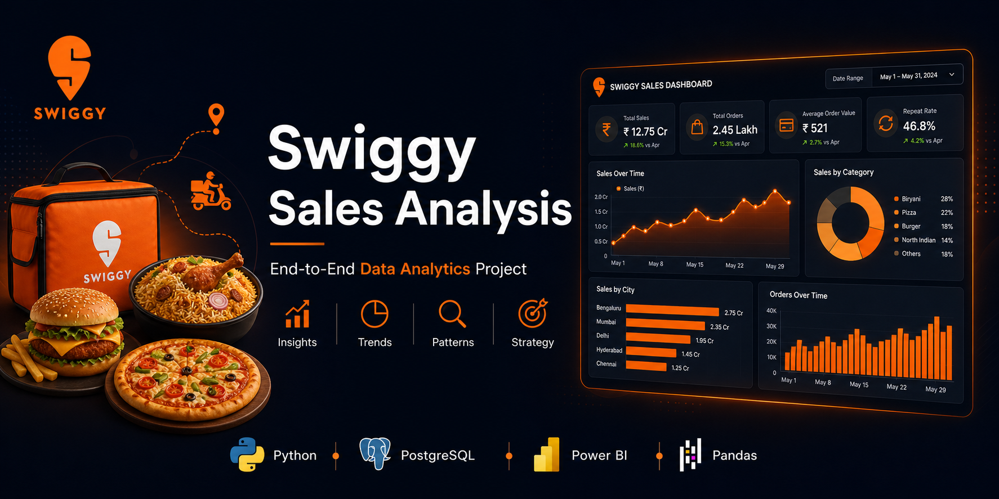
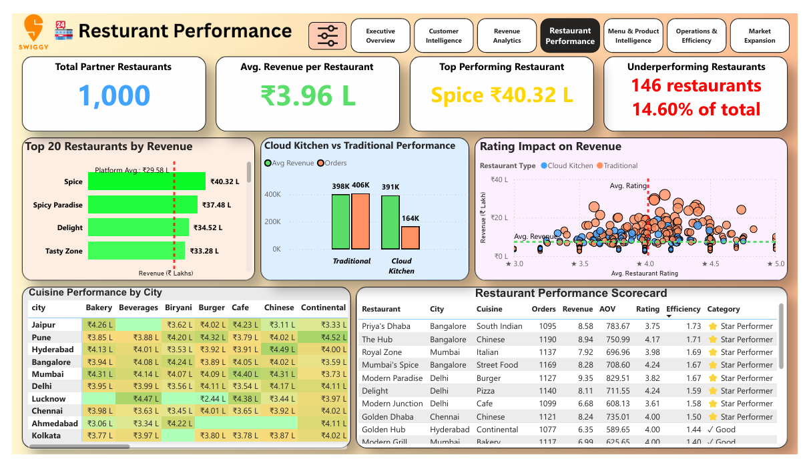
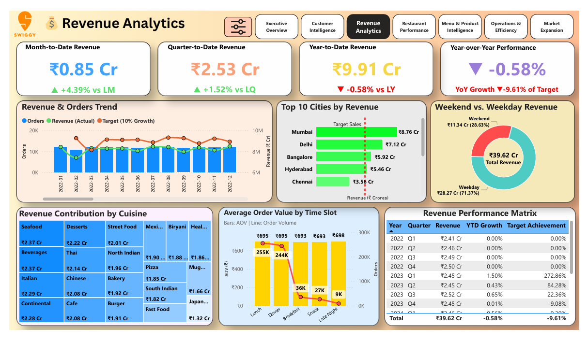

# Swiggy Business & Operations Analytics

A professional, recruiter-friendly analytics portfolio project built around synthetic food-delivery data. This repository demonstrates how raw transactional data can be transformed into business insight using Python, SQL, and Power BI.

> Attribution and reference: This project is based on the public educational repository by Harsh Belekar, adapted and restructured for portfolio use. The original reference remains in the repository history and source materials, and licensing obligations are preserved under the MIT license.



## Business problem
Swiggy-style food delivery businesses need to answer critical questions around revenue growth, customer retention, restaurant performance, city expansion, and operational efficiency. This project turns raw order data into a structured business analytics story that highlights how business decisions can be guided by data.

## Project objective
Build a professional end-to-end analytics project that demonstrates:
- Python-based data exploration and validation
- SQL-based business KPI analysis
- Power BI dashboard storytelling
- Data modeling and business recommendations
- Clean documentation suitable for portfolio and recruiter review

## Business questions
- Which cities generate the highest revenue?
- Which restaurants perform best by revenue and order volume?
- What is the cancellation rate and how can it be reduced?
- Which customer segments are most valuable?
- What is the average order value, and how can revenue be increased?
- Which time-of-day patterns drive demand?
- Where should the business focus expansion and operational improvements?

## Dataset description
This project uses a synthetic food-delivery dataset designed for educational and portfolio analysis. It contains realistic business-like fields for customers, restaurants, menu items, orders, and order line items.

### Current data profile
- 10,000 users
- 1,000 restaurants
- 15,658 menu items
- 600,000 orders
- 1,667,399 order items
- 10 cities across India
- 2022 to 2025 order window

### Actual verified metrics from the included dataset
- Total Orders: 600,000
- Total Revenue: ₹416,956,363.49
- Average Order Value: ₹694.93
- Distinct Customers: 10,000
- Cancellation Rate: 4.95%
- Top revenue city: Mumbai (~₹92.16M)

## Technology stack
- Python
- Pandas, NumPy
- SQL / PostgreSQL
- Power BI
- DAX and Power Query
- Jupyter Notebook
- Git / GitHub

## Architecture and workflow
1. Raw data ingestion from CSV sources
2. Data quality and validation checks
3. SQL schema and business analysis queries
4. Python exploratory analysis and KPI validation
5. Power BI data modeling and storytelling
6. Documentation and portfolio presentation

## Data model
This project follows a star-schema-friendly structure.

- Fact table: orders
- Dimension tables: users, restaurants, menu
- Supporting transaction detail: order_items

This keeps metrics such as revenue, order volume, and cancellations easy to analyze across customer, restaurant, and city dimensions.

## Power BI dashboard pages
The included report focuses on the following page clusters:
- Executive Overview
- Customer Analytics
- Restaurant Analytics
- Revenue & Sales Analytics
- Delivery / Operations Analytics
- Business Insights

The current dashboard file is stored in:
- `powerbi/Swiggy_Business_Analytics.pbix`

## Key KPIs
- Total Orders
- Total Revenue
- Average Order Value
- Total Customers
- Cancellation Rate
- Revenue by City
- Restaurant Revenue
- Customer Revenue
- Orders per Customer
- Monthly Revenue Trend

## Business insights
The project documents trend-based, dashboard-ready business observations such as:
- Revenue concentration across major metro cities
- Stable but monitorable cancellation rate
- Strong customer spend and repeat-purchase potential
- Restaurant concentration and revenue inequality across partners
- Operational benefit of inventory and cancellation controls

## Recommendations
- Focus expansion in high-performing metro cities
- Improve restaurant responsiveness and inventory reliability
- Use personalized offers for high-value customers
- Create retention programs for repeat and high-frequency users
- Continue tracking cancellation root cause categories to reduce wasted delivery effort

## Screenshots






## Live Power BI Dashboard
A live public Power BI Publish-to-Web URL has not been created yet.

Placeholder:
- Publish-to-web URL: Pending

This repository intentionally does not fabricate a public dashboard URL. Recruiters can review the dashboard locally through Power BI Desktop and through the screenshot previews included here.

## How to run the project

### CSV-first portfolio workflow (recommended default)
This project is designed to work without PostgreSQL so it can be used as a clean, recruiter-friendly data portfolio demo.

### 1. Create a virtual environment
```bash
python -m venv .venv
source .venv/bin/activate  # Linux/macOS
.venv\Scripts\activate   # Windows
```

### 2. Install dependencies
```bash
pip install -r requirements.txt
```

### 3. Run the CSV analytics pipeline
```bash
python python/scripts/csv_analytics_pipeline.py
```

This reads the raw CSV files in `Data/raw`, validates them, and saves processed outputs in `data/processed`.

### 4. Run data quality checks
```bash
python python/scripts/data_quality_checks.py
```

### 5. Run EDA summary
```bash
python python/scripts/eda_summary.py
```

### 6. Open notebooks
Use the notebooks in `python/notebooks` or open a Jupyter session.

### 7. Open the dashboard
Open `powerbi/Swiggy_Business_Analytics.pbix` in Power BI Desktop and refresh the model if needed.

### Optional: PostgreSQL workflow for SQL demos
If you want to showcase database skills locally, the repository also includes optional PostgreSQL scripts. These are not required for the default portfolio workflow.

```powershell
powershell -ExecutionPolicy Bypass -File .\setup_windows.ps1 -EnablePostgresSetup
```

## How to view the dashboard
- Open Power BI Desktop and select `powerbi/Swiggy_Business_Analytics.pbix`
- Review the included screenshots in the GitHub repository
- When the dashboard is published publicly, replace the placeholder URL in this section

## Repository structure
```text
Swiggy-Business-Operations-Analytics/
├── data/
│   ├── raw/
│   │   ├── users.csv
│   │   ├── restaurants.csv
│   │   ├── menu.csv
│   │   ├── orders.csv
│   │   └── order_items.csv
│   └── processed/
│       └── README.md
├── sql/
│   ├── schema/
│   │   └── 01_create_schemas.sql
│   ├── data_cleaning/
│   │   └── 01_data_quality_checks.sql
│   └── business_analysis/
│       └── 01_business_kpis.sql
├── python/
│   ├── notebooks/
│   │   └── README.md
│   └── scripts/
│       ├── data_quality_checks.py
│       └── eda_summary.py
├── powerbi/
│   ├── Swiggy_Business_Analytics.pbix
│   ├── screenshots/
│   └── documentation/
├── docs/
│   ├── business_requirements.md
│   ├── data_dictionary.md
│   ├── data_model.md
│   └── business_insights.md
├── .gitattributes
├── .gitignore
├── LICENSE
├── README.md
├── requirements.txt
├── Banner.png
├── Dashboard/              # original reference materials retained
├── Database/               # original SQL reference files retained
├── Docs/                   # original project documentation retained
├── Data/                   # original source zip files retained
├── Scripts/                # original reference scripts retained
├── Notebooks/              # original reference notebooks retained
└── Visuals/                # original reference visuals retained
```

## Data limitations
The synthetic dataset is useful for analytical learning and dashboard design, but it does not include:
- actual driver IDs
- actual delivery-duration timestamps
- route optimization logs
- live customer PII or real business data
- payment gateway credentials or environment secrets

This makes the project safe for GitHub sharing and appropriate for a public portfolio.

## Original/reference attribution
Original project reference:
- Harsh Belekar: https://github.com/Harsh-Belekar/Swiggy-Sales-Analysis

The current project adapts and reorganizes the reference work into a cleaner portfolio structure while preserving original attribution and the MIT license. This is a portfolio adaptation and should not be presented as a totally original business dataset or as a real production platform.

## Future improvements
- Add a normalized star schema model in PostgreSQL
- Expand the Power BI report with a clearer page layout and slicers
- Add a time intelligence calendar table for robust growth analysis
- Include more advanced customer segmentation and retention metrics
- Add a deployment-ready dashboard publish workflow
- Convert the project into a reproducible end-to-end pipeline with dbt or Python orchestration

## License
This project retains the MIT license from the original reference. See `LICENSE` for details.
